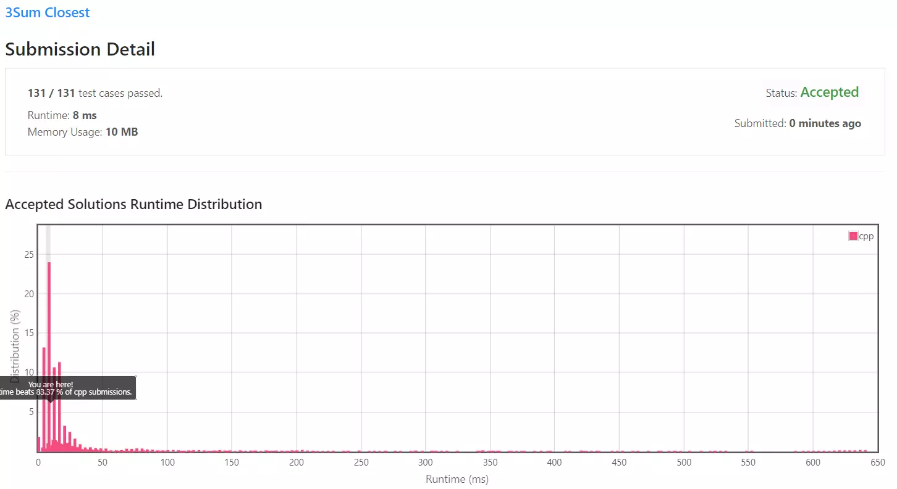

## LeetCode - 16. 3Sum Closest
문제 - [LeetCode - 16. 3Sum Closest](https://leetcode.com/problems/3sum-closest/)

## 문제 설명
숫자 배열과 target 숫자가 주어지면 숫자 배열에서 세 숫자를 더했을 때 target 숫자와 가장 가까운 세 숫자의 덧셈을 반환하면 되는 문제입니다.

난이도는 `MEDIUM` 난이도 입니다.

## 풀이
[My Solutions(Github)](https://github.com/LDobac/leetcode/tree/master/16.%203Sum%20Closest)

### Solution
문제 [LeetCode - 15. 3Sum](https://jaehee.dev/#/post/15)과 상당히 유사한 문제입니다. 유일하게 다른점은 모든 가짓수를 반환하는 것이 아닌 덧셈의 결과를 반환한다는 점과, target에 해당하는 숫자가 없더라도 가장 가까운 덧셈을 반환해야 합니다.

15번 문제와 상당히 유사하므로 적절한 세 숫자를 찾이 위해 순회를 하는 과정은 제외하고, target 숫자와 가장 가까운 숫자를 구하는 방법 위주로 설명하겠습니다.

간단히 생각해보도록 하겠습니다. target 숫자와 가장 가까운 세 숫자의 덧셈을 찾아내면 되는 문제입니다. 이를 그래프상에 놓는다고 생각한다면 target 숫자와 가장 *거리*가 가까운 덧셈의 결과를 찾으면 됩니다.

*거리*를 구하는 방법은 수학적으로 다양하게 있지만, 여기서는 가장 기본적인 *절대값*을 이용해 target 숫자와의 거리를 계산하겠습니다.

*절대값*은 일반적으로 수직선상의 특정 점에서부터 얼마나 떨어졌는가를 계산할 수 있습니다. 이를 이용해 target 숫자와의 거리를 계산할 수 있습니다. 그리고 모든 수에 대해서 순회를 하면서 거리가 0이 되거나 가장 거리가 가까운 덧셈을 반환하면 됩니다.

```cpp
int shortestPath = INT_MAX;
```

지금까지 계산한 거리 중 가장 target 숫자와 가까운 거리를 저장하는 변수인 `shortestPath`를 선언하겠습니다. 입력된 숫자들은 `int` 배열이므로, int형 변수로 선언하며, 초기 값은 int형 변수의 최대값으로 초기화하겠습니다.

```cpp
int sum = nums[i] + nums[left] + nums[right];
int path = abs(target - sum);

if (sum > target) right--;
else if (sum < target) left++;

if (path == 0)
{
    return sum;
}
else if (path < shortestPath)
{
    shortestPath = path;
    result = sum;
}
```

반복문 내부입니다. 순회 과정에 대한 정확한 설명은 [문제 15](https://jaehee.dev/#/post/15)를 참고하시면 좋습니다.

현재 선택된 세 숫자를 더해 target 숫자와의 차에 대해서 절대값을 계산합니다.

만약 절대값(path 변수)이 0이라면 target 숫자와 동일한 덧셈이 존재한다는 의미으로 바로 함수를 반환합니다.

아니라면 현재 계산된 거리가 가장 target과 가까운 거리인지 확인하고 해당하는 변수들을 업데이트합니다. 그리고 모든 순회가 종료되고 가장 거리가 가까웠던 합계를 반환하면 됩니다.

#### 제출 결과


실행 시간은 8ms가 나왔으며, 다른 C++ 제출자에 비해 80% 가량의 성능을 보임을 확인할 수 있습니다.

<details>
<summary>코드 전문</summary>

```cpp
class Solution 
{
public:
    int threeSumClosest(vector<int>& nums, int target) 
    {
        int result;
        int shortestPath = INT_MAX;

        sort(nums.begin(), nums.end());

        for (int i = 0; i < nums.size(); i++)
        {
            if (i > 0 && nums[i] == nums[i - 1]) continue;

            int left = i + 1;
            int right = nums.size() - 1;

            while (left < right)
            {
                int sum = nums[i] + nums[left] + nums[right];
                int path = abs(target - sum);

                if (sum > target) right--;
                else if (sum < target) left++;

                if (path == 0)
                {
                    return sum;
                }
                else if (path < shortestPath)
                {
                    shortestPath = path;
                    result = sum;
                }
            }
        }

        return result;
    }
};
```

</details>
