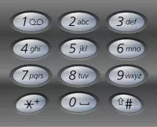
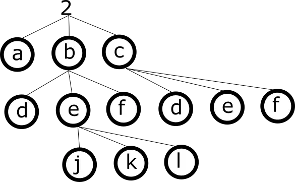
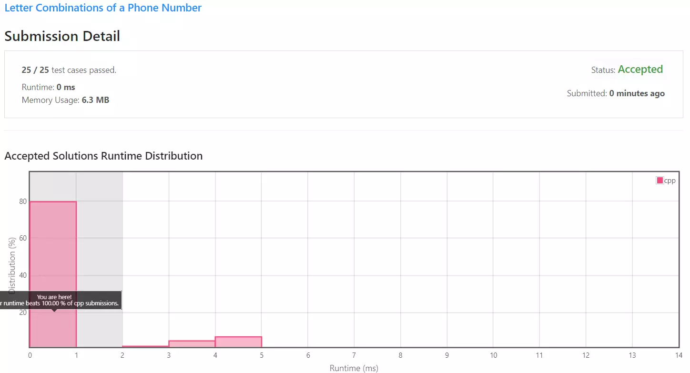

## LeetCode - 17. Letter Combinations of a Phone Number
문제 - [LeetCode - 17. Letter Combinations of a Phone Number](https://leetcode.com/problems/letter-combinations-of-a-phone-number/)

## 문제 설명


2-9 사이로 구성된 숫자 문자열이 입력으로 들어오면 위 핸드폰 자판에 매핑되는 문자들에 대해서 모든 문자열 조합을 만드는 문제입니다.

예를 들어 숫자 *23*이 입력으로 들어왔다면 `2 : abc`, `3 : def`의 조합인 `["ad", "ae", "af", "bd", "be", "bf", "cd", "ce", "cf"]`를 구하면 되는 문제입니다.

난이도는 `MEDIUM` 난이도 입니다.

## 풀이
[My Solutions(Github)](https://github.com/LDobac/leetcode/tree/master/17.%20Letter%20Combinations%20of%20a%20Phone%20Number)

### Solution - DFS, Backtracking
본 문제를 처음보자마자 생각난 풀이 방법은 [Cartesian product](https://en.wikipedia.org/wiki/Cartesian_product)이였습니다.


카테시안 곱은 두 집합의 각 원소에 대한 모든 순서쌍을 정의하는 연산입니다. 본 문제 또한 연산의 결과가 카테시안 곱과 동일하게 나타나니 적용가능할 듯 합니다.

카테시안 곱을 구현하기 위해서 문제를 트리 형태로 표현해보도록 하겠습니다.



`235`라는 숫자가 주어졌다면, 2의 문자에 해당하는 "abc"와 5의 문자에 해당하는 "def", 그리고 7에 해당하는 "jkl"에 대해서 카테시안 곱 연산을 통해 모든 가짓수를 찾아야 합니다.

이를 계산하기 위해서 위 이미지와 각 'a', 'b', 'c'에 대해서 'd', 'e', 'f' 문자가 붙는 경우, 또 깊숙히 내려갈수록 5에 대한 문자열이 붙는 경우에 대해서 트리로 표현할 수 있습니다. 즉, 위 트리가 상태 공간이 되는 것이죠.

여기서 필요한 내용은 위 상태 공간 트리의 가장 말단 노드(Leaf node)까지 탐색할 때 과정에서 각 문자의 조합들이 필요합니다. 즉 DFS(깊이 우선 탐색)를 수행하면서 중간에 문자열을 합치다가 말단 노드에 도달하면 해당 문자열을 반환하면 될 것 같습니다.

(문제를 푼 후 다른 풀이를 찾아보니, 말단 노드를 탐색 한 후 다시 뒤로 돌아가 다른 경우의 수를 찾기때문에 Backtracking 탐색이라고도 할 수 있을 것 같습니다.)

DFS는 스택 또는 재귀 함수로 구현할 수 있습니다. 이번에는 간단하게 재귀 함수로 구현해보겠습니다.

```cpp
vector<string> numToLetters = {
    "",
    "",
    "abc",
    "def",
    "ghi",
    "jkl",
    "mno",
    "pqrs",
    "tuv",
    "wxyz",
};
```

먼저 각 숫자에 대해서 문자를 매핑할 수 있도록 별도의 배열을 선언합니다. `map` STL 자료형을 이용해 딕셔너리나, 해시 테이블의 형태로도 충분히 구현가능합니다.

```cpp
vector<string> letterCombinations(string digits) 
{
    if (digits.size() == 0) return vector<string>();

    vector<string> result;

    com(digits, 0, "", result);

    return result;
}
```

함수 자체는 재귀 함수만 호출해주는 형태입니다.

```cpp
void com(const string& digits, int digitIndex, string str, vector<string>& out)
{
    if (digitIndex == digits.size()) 
    {
        out.push_back(str);
        return;
    }

    string& letters = numToLetters[digits[digitIndex] - '0'];

    for (int i = 0; i < letters.size(); i++)
    {
        com(digits, digitIndex + 1, str + letters[i], out);
    }
}
```

재귀 함수로 매우 간단합니다. 하나씩 살펴보도록 하겠습니다.

```cpp
if (digitIndex == digits.size()) 
{
    out.push_back(str);
    return;
}
```

현재 순회하는 노드가 말단 노드인경우 지금까지 조합한 문자열을 결과 배열에 삽입합니다. Backtracking이므로 이전 노드로 돌아가 다른 경우를 탐색한다고 볼 수 있겠네요.

```cpp
string& letters = numToLetters[digits[digitIndex] - '0'];
```

현재 입력된 수의 문자들을 가져옵니다. '0'을 빼는 이유는 문자열로 숫자가 입력되기 때문입니다.

```cpp
for (int i = 0; i < letters.size(); i++)
{
    com(digits, digitIndex + 1, str + letters[i], out);
}
```

그리고 현재 문자들을 순회하면서 새로이 재귀 함수를 호출합니다. 재귀를 호출할때는 현재 탐색하는 숫자 문자의 다음을 선택하고, 지금까지 탐색했던 문자들을 모두 조합하면서 새로운 재귀 함수를 호출합니다.

#### 제출 결과


실행속도는 0ms입니다. 시간 복잡도는 O(4^n)으로 생각할 수 있을 것 같습니다.

트리의 깊이는 입력된 숫자 문자열의 길이와 같습니다. 예를 들어 숫자 2만 주어졌다면 "abc"가 depth=1이 되겠습니다. "23"이 주어진다면 "abc"가 depth=1, 그리고 각 "a", "b", "c" 노드마다 "def"의 노드가 붙게됩니다.

그리고 숫자 7, 8, 9의 경우 각 문자가 4개씩 되게때문에 최악의 경우 7, 8, 9로만 이루어진 숫자가 입력될 수 있습니다.

때문에 O(n^4)로 계산할 수 있겠습니다.

<details>
<summary>코드 전문</summary>

```cpp
class Solution 
{
public:
    vector<string> numToLetters = {
        "",
        "",
        "abc",
        "def",
        "ghi",
        "jkl",
        "mno",
        "pqrs",
        "tuv",
        "wxyz",
    };

    vector<string> letterCombinations(string digits) 
    {
        if (digits.size() == 0) return vector<string>();

        vector<string> result;

        com(digits, 0, "", result);

        return result;
    }

    void com(const string& digits, int digitIndex, string str, vector<string>& out)
    {
        if (digitIndex == digits.size()) 
        {
            out.push_back(str);
            return;
        }

        string& letters = numToLetters[digits[digitIndex] - '0'];

        for (int i = 0; i < letters.size(); i++)
        {
            com(digits, digitIndex + 1, str + letters[i], out);
        }
        
    }
};
```

</details>
