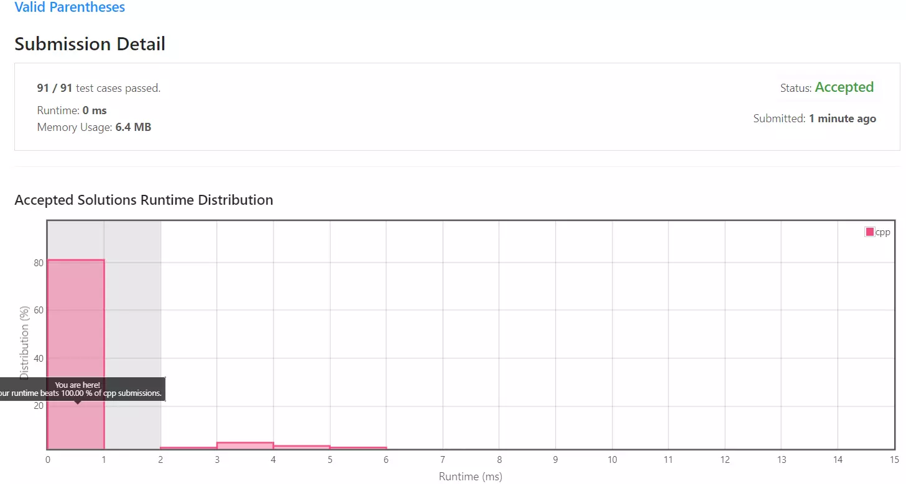

## LeetCode - 20. Valid Parentheses
문제 - [LeetCode - 20. Valid Parentheses](https://leetcode.com/problems/valid-parentheses/)

## 문제 설명
문자열이 주어질 때 소괄호`()`, 중괄호`{}`, 대괄호`[]`가 올바른 순서로 잘 열리고 닫혔는지 확인하는 문제입니다.

난이도는 `EASY` 난이도 입니다.

## 풀이
[My Solutions(Github)](https://github.com/LDobac/leetcode/tree/master/20.%20Valid%20Parentheses)

### Solution - Stack
괄호는 늘 짝을 지어 닫혀야합니다. 또한 소괄호내에 또 소괄호가 열리거나, 다른 괄호내에 다른 괄호가 열리는 등 괄호가 중첩되기때문에 새로운 괄호가 열리면 해당 괄호에 짝인 닫힘 괄호가 등장하여야 합니다.

때문에 문자열을 순회하면서 가장 최근에 열린 괄호의 짝을 찾아야 하며, 해당 괄호의 짝을 찾고 나면 이전에 순회되었던 열린 괄호의 짝을 찾아야 합니다.

즉 FILO(First In Last Out)로 맨 처음에 순회되었던 괄호가 가장 나중에 닫혀야 합니다. 그러므로 이번 문제 풀이를 위해 스택 자료구조를 사용합니다.

```cpp
stack<char> openBrackets;
```

C++ STL의 stack 자료구조를 선언합니다.

```cpp
for (char ch : s)
{
    ...
}
```

그리고 입력된 문자열을 순회합니다. 반복문 내에서 괄호가 올바르게 열렸고, 닫혔는지 확인합니다.

```cpp
if ('(' == ch || '{' == ch || '[' == ch)
{
    openBrackets.push(ch);
}
```

처음으로는 열린 괄호를 확인합니다. 열린 괄호라면 스택에 삽입해 가장 최근에 삽입된(스택의 top) 열린 괄호의 짝인 닫힌 괄호를 찾습니다.

```cpp
else if (')' == ch || '}' == ch || ']' == ch)
{
    if (openBrackets.size() == 0) return false;

    char openBracket = openBrackets.top();

    if (
        !(
            ('(' == openBracket && ')' == ch) || 
            ('{' == openBracket && '}' == ch) || 
            ('[' == openBracket && ']' == ch)
        )
    )
    {
        return false;
    }

    openBrackets.pop();
}
```

만약 닫힌 괄호라면 스택의 top을 가져와 가장 최근에 탐색된 열린 괄호와 짝인지 확인합니다. 만약 아니라면 함수는 false를 반환하며, 짝이라면 스택에서 해당 열린 괄호를 pop하고 계속 순회를 합니다.

닫힌 괄호가 등장했는데, 열린 괄호를 저장하는 스택의 크기가 0이라면 잘 못 닫힌 괄호이므로 즉시 함수는 false를 반환합니다.

```cpp
return openBrackets.size() == 0;
```

모든 순회가 끝나고 나면 함수를 반환합니다. 단, 만약 스택의 크기가 0이 아니라면 정상적으로 닫히지 않은 괄호가 있는 뜻이니, false를 반환하도록 합니다.

추가적으로 자잘한 최적화를 위해서 함수의 시작 부분에 다음 구문을 추가하였습니다.

```cpp
if (s.size() % 2 != 0) return false;
```

정상적으로 열리고 닫힌 괄호는 2개의 문자로 이루어졌으므로, 만약 입력된 문자열의 길이가 홀수라면 하나의 문자는 정상적으로 닫히거나 열리지 않았다는 의미가 됩니다.

그러므로 입력된 문자열의 길이가 홀수라면 즉시 false를 반환합니다.

#### 제출 결과


<details>
<summary>코드 전문</summary>

```cpp
class Solution 
{
public:
    bool isValid(string s) 
    {
        if (s.size() % 2 != 0) return false;

        stack<char> openBrackets;

        for (char ch : s)
        {
            if ('(' == ch || '{' == ch || '[' == ch)
            {
                openBrackets.push(ch);
            }
            else if (')' == ch || '}' == ch || ']' == ch)
            {
                if (openBrackets.size() == 0) return false;

                char openBracket = openBrackets.top();

                if (
                    !(
                        ('(' == openBracket && ')' == ch) || 
                        ('{' == openBracket && '}' == ch) || 
                        ('[' == openBracket && ']' == ch)
                    )
                )
                {
                    return false;
                }

                openBrackets.pop();
            }
        }

        return openBrackets.size() == 0;
    }
};
```

</details>
