## 2024-06-06 변경 사항
SEO 등의 문제로 인해 Vue에서 Astro Framework로 블로그를 변경했습니다.

따라서 아래에서 설명하는 문제점은 지금 블로그와는 무관합니다.

---

## Webpack의 간단한 소개
Webpack은 흔히 *bundler*라고 부릅니다. 웹 개발을 하다 보면 다양한 자바스크립트 파일과 CSS 파일이 생성됩니다.

이렇게 여러 파일을 하나로 묶어 생성하는 작업을 *bundle*이라고 하고, 이 작업을 수행하는 툴이나 라이브러리를 *bundler*라고 부릅니다.

물론 Webpack은 단순한 *bundle* 작업뿐만 아니라 *pipeline*을 통해 원하는 일련의 작업을 수행할 수 있도록 해줍니다.

Webpack을 통해 여러 파일을 하나로 출력하면 파일이 간결해지고, 중간에 여러 파이프라인을 거치며 코드에 대한 전처리/후처리가 가능하다는 장점이 있습니다.

반면 단점은 파일을 하나로 합치기 때문에 코드 용량이 크면 첫 로딩이 많이 느려지고, 사용자가 당장 접속하지 않는 페이지의 자원까지 처음부터 로딩하므로 비효율적일 수 있다는 점입니다.

## 현재 문제점
이 블로그를 개발하면서 게시글은 Markdown으로 작성하고, 빌드 시 게시글·태그 정보(메타데이터)와 게시글 본문을 각각 별도의 json 파일과 js 파일로 생성합니다.

이 메타데이터와 게시글 파일은 코드 내에서 동적으로 불러옵니다.

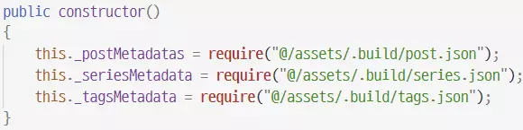
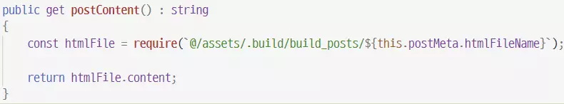

json, js 모듈을 동적으로 불러오기 위해 `require`를 이용해 다른 파일의 모듈을 불러오고 있습니다.

위 방식으로 블로그를 빌드하면

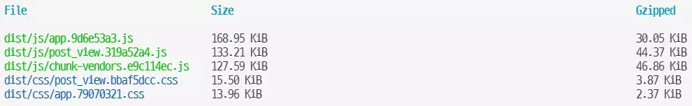

단 5개의 파일만 출력됩니다. chunk_vendors와 post_view js 파일은 이미 코드를 split해두었기 때문에 문제가 없지만, 메타데이터와 게시글 내용은 모두 app.js 파일 안에 들어가 있습니다.

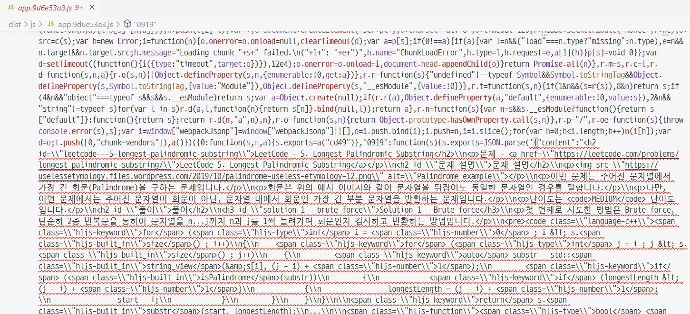

빌드된 app.js 파일의 내용입니다. 알아보기는 힘들지만, 게시글의 모든 내용이 한 파일 안에 담겨 있습니다. 즉, 유저가 블로그에 접속하면 원하지 않아도 다른 모든 게시글의 내용을 강제로 로드하게 됩니다.

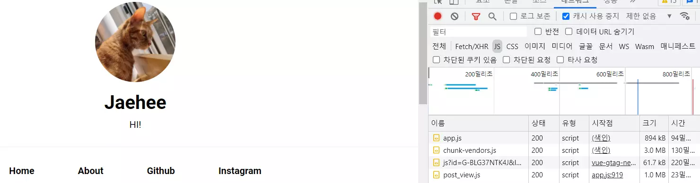

현재 문제가 있는 상태에서 크롬 개발자 도구의 네트워크 profiler로 파일이 로드되는 과정을 확인해보았습니다.

총 4개의 js 파일이 로드되는데, chunk-vendors와 post_view 파일은 코드를 미리 분리해두었기에 따로 로드되고, 세 번째 파일은 GA입니다. 결국 하나의 app.js가 로드되는데, 이 안에 모든 게시글의 내용이 담겨 있습니다.

위 페이지는 게시글 하나만 참조하고 있지만, 다른 모든 게시글의 내용도 함께 로드되는 상황입니다. 당장은 용량이 800kb 정도밖에 되지 않지만, 게시글이 계속 늘어나면 상당히 부담스러워질 것 같습니다.

webpack의 code split 기능을 이용해 게시글과 메타데이터를 각각 별도 파일로 분리하고, lazy loading으로 게시글을 참조할 때만 해당 파일을 새로 로드하도록 개선해보겠습니다.

### 정적 import에 대한 code split
이번에 다룰 주제는 동적 import에 대한 code split과 lazy loading입니다.

정적 import와 동적 import는 이론적인 과정과 내용이 다르며, 정적 import 모듈에 대한 code split은 webpack의 config 파일에서 수행하기 때문에 설정 방법도 다릅니다.

자세한 사항은 webpack의 code split 페이지를 참고하시면 좋습니다.
[Webpack Code split](https://webpack.js.org/guides/code-splitting/)

## 동적 import, code split 그리고 lazy loading
사실 코드를 파일별로 분리하고 lazy loading하는 방법은 webpack이 이미 **아주 간단히** 제공하는 기능입니다.

[Webpack Dynamic Import](https://webpack.js.org/api/module-methods/#dynamic-expressions-in-import)

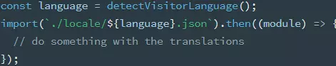

단순히 import 함수를 호출하기만 하면 *code split*과 *lazy loading*을 **둘 다** 기본적으로 수행합니다.

기존 코드는 *require*문으로 모듈을 동적으로 불러오고 있는데, 단순히 *import*문으로 교체하면 해결될 것으로 보입니다.

즉, 기존의 아래 코드를

import 함수로 교체하면 아래처럼 됩니다.

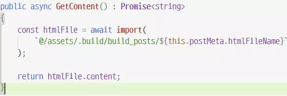

다만 require 함수는 동기적으로 동작하지만 import 함수는 비동기적으로 동작하기 때문에 Promise 처리를 해주어야 합니다.

동일하게 메타데이터를 불러오는 코드도 require 함수에서 import 함수로 변경했습니다.

다시 빌드해보겠습니다.

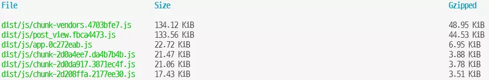

5개였던 파일이 chunk-...js라는 이름의 여러 파일로 나뉘었습니다. 동시에 app.js 파일의 용량도 이전보다 줄어들었네요. 즉, 각 게시글 내용과 메타데이터가 별도의 파일로 분리된 것입니다.

또한 webpack 문서에 따르면 import 함수로 동적 로드한 모듈에는 lazy loading이 기본적으로 적용된다고 하니, 원하는 목적을 모두 달성한 셈입니다.

### 동적 import에 옵션 전달하기
원하는 목적은 모두 이루었지만, 한 가지 아쉬운 점은 파일명이 chunk-[hash] 값이라서 어떤 게시글 파일인지 식별하기 어렵다는 것입니다.

정적 import의 code split과 마찬가지로 적절한 파일명을 지정하거나 옵션을 전달할 수 있습니다.

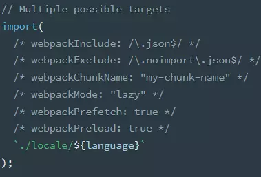

특이하게도 주석을 통해 해당 동적 import에 옵션을 전달할 수 있습니다.

자세한 설명은 [webpack dynamic import](https://webpack.js.org/api/module-methods/#dynamic-expressions-in-import) 문서에서 각 옵션에 대한 설명을 확인할 수 있습니다.

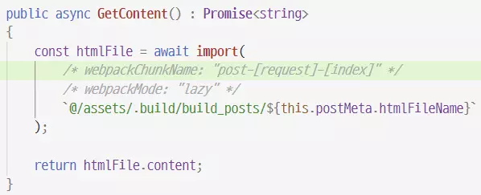

위와 같이 주석을 추가해 파일명을 적절히 지정합니다. *[request]*는 파일명으로 치환되고, *[index]*는 단순한 정수 index 값으로 치환됩니다.

위와 같이 코드를 변경하고 다시 빌드를 수행합니다.

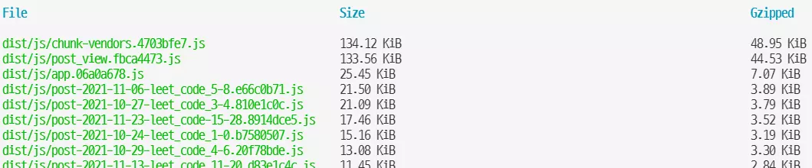

분리된 각 파일이 식별하기 좋은 이름으로 변경된 것을 확인할 수 있습니다.

### require vs import
이 문제를 해결하기 위해 단순히 *require*문을 *import*문으로 변경했습니다. Webpack에서는 require문을 통한 동적 모듈 로드 시 import처럼 기본적으로 code split과 lazy loading을 지원하지 않는데, 이는 두 모듈의 로드 방식에 차이가 있기 때문입니다.

[Reference](https://stackoverflow.com/questions/46677752/the-difference-between-requirex-and-import-x)

일반적으로 require는 CommonJS의 모듈 로드 방식이고, import는 ES6의 로드 방식입니다.

자바스크립트 표준에 따라 모듈 로드 방식이 달라집니다. (babel을 이용한 import문은 require로 변환되지만, 내부적으로는 ES6의 import와 동일하게 동작하도록 변환된다고 합니다.)

require 구문은 출력할 모듈을 미리 계산하지만, import 구문은 호출될 때 구문을 분석해 출력할 모듈을 결정합니다.

이 방식 덕분에 require 구문은 동적 모듈 로딩을 자유롭게 할 수 있지만, 실제로 실행하지 않아도 모든 모듈을 불러오게 됩니다.

반대로 import 구문은 require 구문처럼 아무 경로나 자유롭게 넣을 수 없습니다. 최소한 특정 폴더나 파일을 지정해주어야 합니다(webpack 문서에 설명되어 있습니다). 하지만 구문이 분석되고 나면 필요한 모듈만 따로 로드해서 사용할 수 있다는 장점이 있습니다.

Webpack에서는 require 구문에도 lazy loading을 적용할 수 있는 기능을 제공합니다.

[Webpack-specific require](https://webpack.js.org/api/module-methods/#webpack)

다만 webpack을 사용하지 않는 경우라면 위 기능은 사용할 수 없으니 주의해야 합니다.

### network profiler로 확인

동적 import에 code split과 lazy loading을 적용했으니, 블로그를 둘러볼 때 아직 보지도 않은 모든 게시글의 내용을 한꺼번에 불러오는 문제는 없어졌을 것으로 생각됩니다.

다시 한 번 크롬 개발자 도구의 network profiler로 확인해보겠습니다.

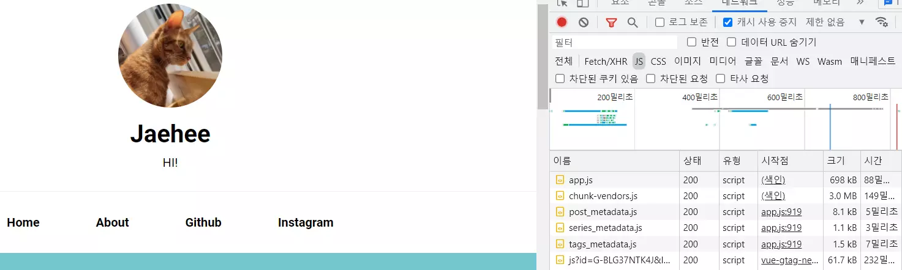

블로그 메인에 접속했을 때 기존과 다르게 게시글 메타데이터 정보 파일이 분리되어 별도로 로딩되는 것을 확인할 수 있습니다. 또한 app.js 파일 크기도 기존 800kb에서 600kb쯤으로 줄어들었습니다.

이제 게시글 하나에 접속해보겠습니다.

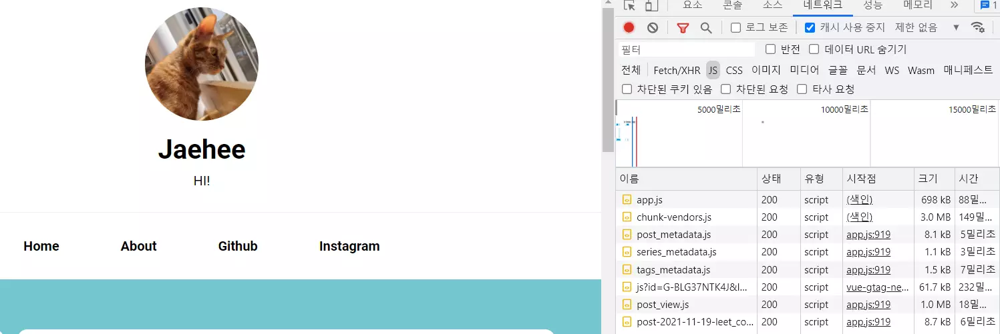

새로운 파일이 하나 로드되었고, 파일명이 post-...로 시작하니 게시글 내용을 담은 파일임을 확인할 수 있습니다. 즉, 블로그에 접속하면 모든 게시글 내용을 한꺼번에 불러오는 것이 아니라, 게시글을 조회할 때만 해당 내용을 lazy loading한다는 것을 확인할 수 있습니다.

## Conclusion
모든 게시글이 하나의 파일로 합쳐져 있어 게시글을 조회하지 않아도 모든 게시글 내용이 함께 로드되던 문제를 수정했습니다.

모든 자바스크립트 코드를 하나의 파일로 합치면 첫 로딩은 느리지만, 이후의 반응성이 좋아진다는 장점이 있습니다.

하지만 유저가 아직 읽지도 않았고 읽을지도 모르는 게시글까지 모두 로드하는 것은 자원 낭비일 것입니다.

이렇게 lazy loading을 사용해 code bundle의 장점은 살리면서, 필요할 때만 자원을 로드해 반응성도 함께 살릴 수 있었습니다.
