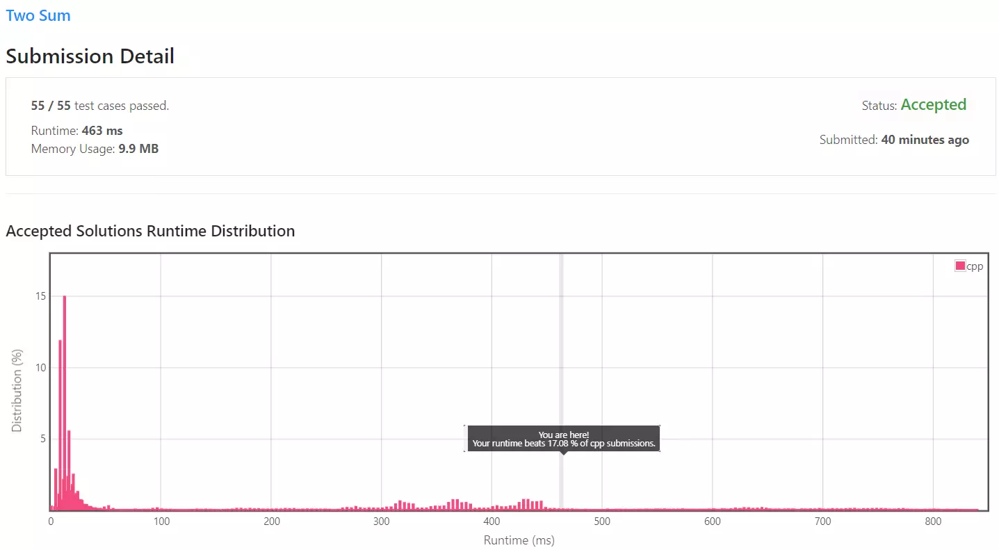
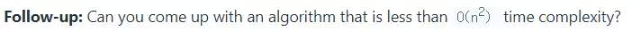
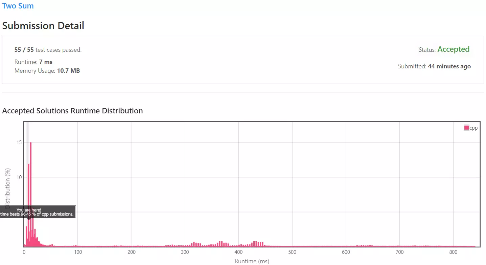

## 문제 개요

난이도 - `EASY` 사용 언어 - `C++`

입력값은 정수형 배열 `nums`와 정수형 `target`이 제공됩니다.
`nums`에서 두 숫자를 더해 `target`과 동일한 값이 나오는 배열 인덱스 두 개를 반환하면 됩니다.

문제 - [LeetCode - 1. Two Sum](https://leetcode.com/problems/two-sum/)

- - -

### 예시

입력 : `nums = [2,7,11,15]` `target = 9`

출력 : `[0,1]`

- - -

### 제약조건

- 배열 내 같은 숫자는 **재사용할 수 없다**.
- 답은 **정확히 하나**만 존재한다.

## 풀이

### Solution 1 - Brute force

첫 번째로 떠올린 방법은 Brute force 즉, 무차별 대입 방법입니다.

이중 중첩 반복문을 통해 배열 내 두 숫자 `nums[x]`, `nums[y]`를 선택하여 더한 후 `target`과 동일한지 확인합니다.

만약 `target`과 동일하다면 두 수의 인덱스 `x`, `y`를 반환하며,
답이 없다면 빈 배열을 반환합니다.

```cpp
for (int x = 0 ; x < nums.size() ; x++) {
    for (int y = x + 1 ; y < nums.size() ; y++) {
        int sumResult = nums[x] + nums[y];

        if (target == sumResult) {
            return std::vector<int>{x, y};
        }
    }

    return std::vector<int>();
}
```

정말 간단하게 배열 내 모든 원소를 순회하면서 `nums[x]`와 `nums[y]`를 선택합니다.

두 값의 덧셈을 `sumResult` 변수에 임시로 저장 후 `target`과 비교하여 정답인지 아닌지 찾습니다.

다만 특별한 점이라면 내부의 중첩된 반복문은 `x + 1`번째부터 시작합니다. 이러한 이유는 문제의 제약조건인 같은 수를 두 번 이상 사용하지 않기 위해서입니다.

만약 `x == y == 0`라면 `nums[0] + nums[0]`이므로 제약조건에 위배됩니다.

두 번째로 `2 + 4 == 4 + 2`의 경우도 제거하기 위해서입니다.

`x = 1, y = 4`인경우 `nums[1] + nums[4]`는 `x = 4, y = 1`일경우 `nums[4] + nums[1]`과 동일하기에 불필요한 탐색입니다.

### Solution 1 - 제출 결과



실행 시간은 `463ms` 소요되었으며, 메모리는 `9.9MB` 사용되었습니다. 실행 시간 기준 하위 17% 정도에 위치하고 있습니다.

이중 중첩 반복문을 사용하고 있기에 O(n^2)의 실행 시간을 갖는 알고리즘입니다.

<details>
<summary>코드 전문</summary>

```cpp
#include <iostream>
#include <vector>
#include <string>
#include <tuple>

class Solution
{
public:
    std::vector<int> Answer(std::vector<int>& nums, int target)
    {
        for (int x = 0 ; x < nums.size() ; x++)
        {
            for (int y = x + 1 ; y < nums.size() ; y++)
            {
                int sumResult = nums[x] + nums[y];

                if (target == sumResult)
                {
                    return std::vector<int>{x, y};
                }
            }
        }

        return std::vector<int>();
    }
};


int main(void)
{
    Solution sol;

    std::vector<std::tuple<std::vector<int>, int>> problems {
        std::make_tuple(std::vector<int>{2, 7, 11, 15}, 9),
        std::make_tuple(std::vector<int>{3, 2 ,4}, 6),
        std::make_tuple(std::vector<int>{3, 3}, 6)
    };

    for (auto problem : problems)
    {
        auto answer = sol.Answer(std::get<0>(problem), std::get<1>(problem));

        for (int num : answer)
        {
            std::cout << num << " ";
        }
        std::cout << std::endl;
    }

}
```

</details>

- - -

### Solution 2 - Hash table



[첫 번째 방법](#solution-1---brute-force)은 O(n^2)의 실행 시간을 갖는 알고리즘입니다. 따라서 이보다 빠른 알고리즘을 찾을 필요가 있습니다.

첫 번째 방법이 O(n^2)의 실행 시간을 갖는 이유는 배열을 중첩 반복문에 배열을 n\*n번 순회하기 때문입니다.
이러한 이유는`nums[0 ~ n] + nums[0 ~ n]`까지 모든 가능성을 테스트하기 때문에 n\*n번의 순회가 필요하게 됩니다.

우린 이러한 탐색 과정을 최적화할 필요성이 있습니다.

현재 숫자를 찾을 때 `nums[x] + nums[y] = target`인 경우를 계속 탐색하고 있습니다. 이 연산을 조금 바꾸면 `target - nums[y] = nums[x]`가 됩니다.

그러므로 여기서 배열 내에 `target- nums[y]`에 대하여 `nums[x]` 값이 존재한다면 인덱스 `(x, y)`가 답이 될 것입니다.

만약 `nums[x]`가 배열 내에 없다면? `target - nums[y + 1]`, `target - nums[y + 2]...` 인 경우에 대해서 탐색해야할 것 같습니다.

결국 똑같이 모든 경우를 탐색해야 하니 O(n^2)의 방법을 가지게 될까요?

이를 해결하기 위해 Hash Table이라는 저장 공간을 사용합니다. Hash Table은 `Key:Value` 형태의 자료구조입니다.

Map, Dictionary같은 자료구조와 비슷하지만, Hash 함수를 이용해 인덱스를 생성하므로 삽입과 탐색이 O(1)로 정의되기에 탐색에서 큰 장점을 보이게 됩니다.

C++에서 Hash Table은 STL [unordered_map](https://en.cppreference.com/w/cpp/container/unordered_map) container으로 제공되고 있습니다.

배열을 순회하면서 현재 원소의 값을 `Key`로 인덱스를 `Value`로 사용하여 Hash Table에 저장합니다.

```cpp
//                num, index
std::unordered_map<int, int> table;
...
table.insert(std::make_pair(nums[x], x));
```

각 원소에 대해 `diff = target - nums[x]`,  `target`과의 차를 계산한 후 `diff`를 `Key`로 Hash Table에서 찾습니다.

```cpp
int diff = target - nums[x];

auto search = table.find(diff);
if (search != table.end()) {
    return std::vector<int>{x, search->second};
}
```

만약 Table내에 `diff`에 대한 `Key`가 존재한다면 배열 내에 `diff`와 똑같은 값을 가지는 원소가 존재한다는 의미입니다.

아까 Hash Table에 저장할 때 원소의 값을 `Key`, 인덱스를 `Value`에 저장했으므로 현재 반복문의 인덱스와 Hash Table에 저장된 인덱스를 반환하면 됩니다.

Hash Table의 삽입/탐색 속도는 O(1)이고, 단일 반복문으로 배열을 n번 순회하므로 본 알고리즘은 O(n)의 실행 시간을 가지게 됩니다.

### Solution 2 - 제출 결과



기존의 약 `500ms`의 속도에서 `7ms`의 속도로 70배 가까이 향상되었습니다.

다만 별도의 저장 공간을 사용했기에 메모리의 크기가 `9.9MB`에서 `10.7MB`로 증가했습니다.

<details>
<summary>코드 전문</summary>

```cpp
#include <iostream>
#include <vector>
#include <string>
#include <tuple>
#include <unordered_map>

class Solution
{
public:
    std::vector<int> Answer(std::vector<int>& nums, int target)
    {
        //                num, index
        std::unordered_map<int, int> table;

        for (int x = 0 ; x < nums.size() ; x++)
        {
            int diff = target - nums[x];

            auto search = table.find(diff);
            if (search != table.end())
            {
                return std::vector<int>{x, search->second};
            }

            table.insert(std::make_pair(nums[x], x));
        }

        return std::vector<int>();
    }
};


int main(void)
{
    Solution sol;

    std::vector<std::tuple<std::vector<int>, int>> problems {
        std::make_tuple(std::vector<int>{2, 7, 11, 15}, 9),
        std::make_tuple(std::vector<int>{3, 2 ,4}, 6),
        std::make_tuple(std::vector<int>{3, 3}, 6)
    };

    for (auto problem : problems)
    {
        auto answer = sol.Answer(std::get<0>(problem), std::get<1>(problem));

        for (int num : answer)
        {
            std::cout << num << " ";
        }
        std::cout << std::endl;
    }

}
```

</details>
