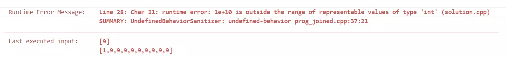
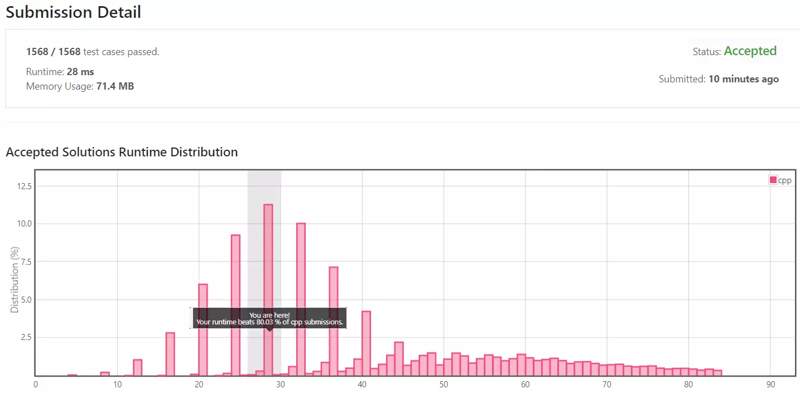

## 목차

## 문제 개요

난이도 - `MEDIUM` 사용 언어 - `C++`

하나의 노드가 숫자 한자리를 가리키는 연결 리스트 두 개가 주어집니다.
단, 연결된 노드의 역순으로 하나의 숫자가 구성됩니다.

두 연결 리스트의 숫자를 더한 후 새로운 연결 리스트를 생성하여 반환해야 합니다.

문제 - [LeetCode 2. Add Two Numbers](https://leetcode.com/problems/add-two-numbers/)

- - -

### 예시


입력: `2 -> 4 -> 3`, `5 -> 6 ->4`

출력: `7 -> 0 -> 8`

각 연결 리스트가 구성하는 숫자는 노드의 역순으로 구성됩니다.
즉 `2 -> 4 -> 3`은 숫자 `342`, `5 -> 6 -> 4`는 `465`가 됩니다.

따라서 출력은 두 수의 덧셈인 $$342+465=807$$의 역순인 `7 -> 0 -> 8`이 됩니다.

- - -

### 제약 조건

* 숫자의 구성은 연결 리스트의 **역순**이기에 주의해야 합니다.

## 풀이

### Solution 1 - 정수 타입 변환

첫 번째 방법은 두 연결 리스트의 숫자를 int형 타입으로 변환하여 덧셈 후 연결 리스트를 생성하는 방법입니다.

```cpp {5} showLineNumbers
int multiplier = 0;
int number = 0;

for (ListNode* node = l1; node != nullptr ; node = node->next) {
    number += node->val * powl(10, multiplier);
    multiplier++;
}
```

연결 리스트의 첫 번째 노드가 1의 자리, 두 번째 노드가 10의 자리로 10배씩 늘어나기에
`pow` 함수를 통해 **숫자 \* 자릿수**로 정수형 변수에 저장합니다.

동일한 방식으로 입력된 두 연결 리스트를 정수형으로 변환하여 두 수를 더합니다.

```cpp {1}
int sum = numOf1 + numOf2;
```

이를 다시 연결 리스트로 변환하여 결과를 반환합니다.

```cpp
ListNode* head = new ListNode(add % 10);
ListNode* result = head;

for (int num = add/10; num > 0 ; num /= 10 ) {
    int digit = num % 10;
 
    ListNode* node = new ListNode(digit);
    result->next = node;
 
    result = node;
}
 
return head;
```

첫 번째 노드가 1의 자리이므로 나머지 연산으로 현재 1의 자릿수를 계산하고 10씩 나눠 다음 자릿수 노드를 계속 생성합니다.

### Solution 1 - 제출 결과



코드의 실행 결과 in t형의 범위를 넘는 값이 입력된 경우 overflow가 발생해 음수가 되며 Runtime Error가 발생하였습니다.

이를 해결하기 위해 두 번째 방법을 사용하였습니다.

- - -

### Solution 2 - 연결 리스트 생성

값의 범위가 32bit인 int 형 변수 대신 더 큰 저장 공간을 가지는 타입을 쓸 수 있겠지만 근본적인 문제 해결을 위해 다른 방법을 시도하겠습니다.

완성된 정숫값으로 변환하고 더하는 것이 아닌, 한 자리씩 더하여 노드를 생성하고 연결 리스트를 생성하는 방식의 알고리즘을 작성해 보겠습니다.

두 연결 리스트에 대해서 반복문을 돕니다.
두 연결 리스트의 순회가 모두 끝나면 반복문에서 탈출하고 만약 한쪽이 먼저 끝나면 숫자를 0으로 가정합니다.

```cpp
...
while (node1 != nullptr || node2 != nullptr) {
    int numOf1 = node1 ? node1->val : 0;
    int numOf2 = node2 ? node2->val : 0;

    ...
}
```

두 수를 더하여 덧셈을 계산합니다.
만약 두수의 합이 **10 이상**이라면 *올림*이 발생했으므로 10을 나누어 올림(carry)을 계산하고,
10의 나머지를 계산하여 해당 자릿수를 구합니다.

발생한 올림은 다음 자릿수 계산에 더해주게 됩니다.

```cpp
...
int sum = numOf1 + numOf2 + carry;

carry = sum / 10;

ListNode* newNode = new ListNode(sum % 10);
...
```

반복문에서 탈출한 이후에 만약 올림이 있다면 해당 숫자도 자릿수에 추가합니다.

```cpp
if (carry > 0) {
    ListNode* node = new ListNode(carry);
    lastNode->next = node;
}
```

### Solution 2 - 제출 결과



실행 시간은 28ms, 메모리 사용량은 71.4MB로 측정되었습니다.

<details>
<summary>코드 전문</summary>

```cpp showLineNumbers
class Solution {
public:
    ListNode* addTwoNumbers(ListNode* l1, ListNode* l2) {
        int carry = 0;

        ListNode* node1 = l1;
        ListNode* node2 = l2;

        ListNode* head = nullptr;
        ListNode* lastNode = nullptr;

        while (node1 != nullptr || node2 != nullptr) {
            int numOf1 = node1 ? node1->val : 0;
            int numOf2 = node2 ? node2->val : 0;

            int sum = numOf1 + numOf2 + carry;

            carry = sum / 10;

            ListNode* newNode = new ListNode(sum % 10);

            if (!head) head = newNode;
            else lastNode->next = newNode;

            lastNode = newNode;

            if(node1) node1 = node1->next;
            if(node2) node2 = node2->next;
        }

        if (carry > 0) {
            ListNode* node = new ListNode(carry);
            lastNode->next = node;
        }
    
        return head;
    }
};
```

</details>

