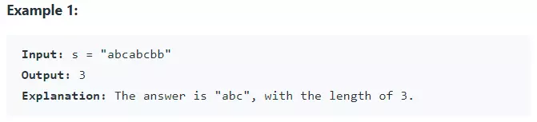
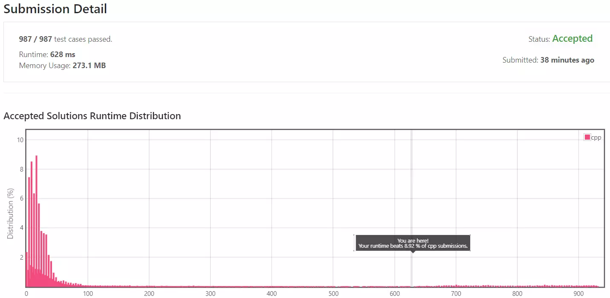
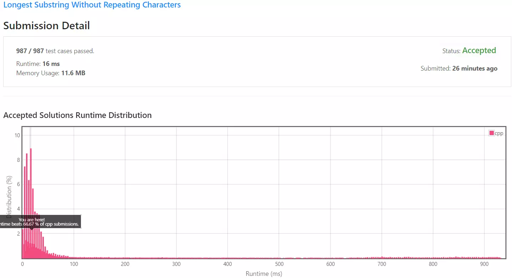
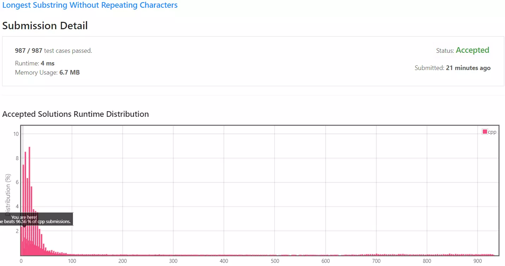

## 목차

## 문제 개요

난이도 - `MEDIUM` 사용 언어 - `C++`

특정 문자열 `s`가 주어질 때 똑같은 문자를 *반복하지 않는* 가장 **긴 부분 문자열**의 길이를 구하는 문제입니다.

문제 - [LeetCode 3. Longest Substring Without Repeating Characters](https://leetcode.com/problems/longest-substring-without-repeating-characters/)

- - -

### 예시



만약 입력 문자열이 `s = "abcabcbb"`라면 반복하는 bb를 제외하고, 반복하지 않는 문자열인 "abc"의 길이인 3이 구해집니다.

- - -

### 제약 조건

- 문자열의 길이는 $$0 \le s.length \le 5 \times 10^4$$입니다.
- 입력 문자열 `s`는 영문자/숫자/심볼/공백문자로만 이루어져 있습니다.

## 풀이

### Solution 1 - Brute force

첫 번째 시도는 무차별 대입을 통한 검사를 진행합니다.

만약 `s` 문자열의 길이가 `n`이라면 `i`가 `0 -> n` 일때 `i ~ n`사이의 부분 문자열을 계속 찾습니다.

```cpp {9-19} showLineNumbers
int lengthOfLongestSubstring(std::string s) {
    // 가장 긴 부분 문자열의 길이
    int longestLength = 0;

    for (int i = 0 ; i < s.size() ; i++) {
        int length = 0;

        for (int j = i ; j < s.size() ; j++) {
            std::string substr = s.substr(i, length);
            int pos = substr.find_first_of(s.at(j));

            if (pos == std::string::npos) {
                // Not found
                length++;

                longestLength = (longestLength < length) ? length : longestLength;
            }  else {
                break;
            }
        }

        if (s.size() - i < longestLength) break;
    }

    return longestLength;
}
```

중첩된 반복문을 이용해 모든 경우의 수를 탐색합니다.

문자열을 찾는 주요 부분은 내부 반복문이니 내부 반복문만 따로 빼서 확인해보겠습니다.

```cpp showLineNumbers
for (int j = i ; j < s.size() ; j++) {
    std::string substr = s.substr(i, length);
    int pos = substr.find_first_of(s.at(j));

    if (pos == std::string::npos) {
        // Not found
        length++;

        longestLength = (longestLength < length) ? length : longestLength;
    } else {
        break;
    }
}
```

문자열 `s`를 `i`부터 `length` 길이만큼 잘라 부분 문자열을 생성합니다.

```cpp
std::string substr = s.substr(i, length);
```

문자열 `s`의 `j`번째 문자를 가져와 현재 부분 문자열에 동일한 문자가 있는지 검사합니다.

```cpp /s.at(j)/
int pos = substr.find_first_of(s.at(j));
```

만약 현재 추출한 부분 문자열에 *동일한 문자(중복되는 문자)가 없다*면 부분 문자열의 길이를 1 증가합니다. 중복된 문자열이 *존재한다면* 반복문을 탈출합니다.

```cpp
if (pos == std::string::npos) {
    // Not found
    length++;

    longestLength = (longestLength < length) ? length : longestLength;
} else {
    break;
}
```

### Solution 1 - 제출 결과



실행 시간은 628ms, 메모리 사용량은 273.1MB가 나오게 되었습니다. 동일한 C++ 제출자에 비해서 상당히 낮은 성적이 기록되었습니다.

부분 분자열을 찾기 위해 문자열 `s`를 `0 -> s.length`까지 부분 문자열로 하나씩 자르면서 다시 중첩 반복문에서 중복 문자를 검사하기 때문에 $$O(n^2)$$ 실행 시간을 가지는 알고리즘입니다.

<details>
<summary>코드 전문</summary>
    
```cpp showLineNumbers
#include <string>

class Solution 
{
public:
    int lengthOfLongestSubstring(std::string s) {
        int longestLength = 0;

        for (int i = 0 ; i < s.size() ; i++) {
            int length = 0;

            for (int j = i ; j < s.size() ; j++) {
                std::string substr = s.substr(i, length);
                int pos = substr.find_first_of(s.at(j));

                if (pos == std::string::npos) {
                    // Not found
                    length++;

                    longestLength = (longestLength < length) ? length : longestLength;
                } else {
                    break;
                }
            }

            if (s.size() - i < longestLength) break;
        }

        return longestLength;
    }
};
```

</details>

### Solution 2 - Sliding window

[첫 번째 방법](#solution-1---brute-force)의 문제점은 중첩된 반복문을 순회하면서 이미 검사한 문자열을 또 다시 검사하기 때문에
중복 검사로 인해서 실행 시간이 늘어나게 되었습니다.

모든 가능성을 다 시도하는 무차별 대입 방법 대신 Sliding Window 기법을 사용해 탐색 효율을 늘려보겠습니다.

Sliding Window는 일정 크기의 버퍼(혹은 시작, 끝 인덱스)를 가지고 탐색 시 버퍼 전체가 좌우로 움직이며 탐색 하는 방법을 말합니다.
> - Sliding Window 예시 이미지 

Sliding Window를 가리키는 두 개의 인덱스 `left`, `right`를 생성합니다.

- 여기에 Sliding Window, left = 0, right = 0인것을 가리키는 화살표가 그려진 이미지 

`right`의 값을 1씩 늘려가며 부분 문자열의 길이를 계속 증가시킵니다.

- 여기에 Sliding Window의 크기가 하나씩 늘어나는 이미지, "abc"까지 늘어남 

`right`의 값이 4가 되면서 부분 문자열은 `"abdc"`이 되면서 부분 문자열 내 중복되는 문자가 발생했습니다.

- 여기에 Sliding Window 크기가 4가 되면서 a(빨간색으로 표시)가 중복되는 사진

문자열을 검사하면서 "abc"에서 "abca"가 되었다면 이때 문자 "a"가 겹치게 되므로 이 문자열은 정답이 될 수 없습니다.

하지만 문자열 `s = "abcabcbb"`가 주어질 때 여기서 중복되지 않는 문자들의 집합인 부분 문자열의 **길이**가 가장 긴 것을 구하는 것입니다. 때문에 부분 문자열이 `"abc"`이든 `"bca"` 이든 중복된 문자가 없다는 조건만 만족하면 둘 다 최장 부분 문자열이므로 답이 될 수 있습니다.

그러므로 `left`의 값을 1증가 시켜 다시 유효한 부분 문자열로 조정합니다.

- 여기에 left = 1, right = 4인 Sliding Window 이미지

```cpp showLineNumbers
int lengthOfLongestSubstring(std::string s)  {
    if (s.size() == 0) return 0;
    else if (s.size() == 1) return 1;

    int longestLength = 0;

    int left = 0;
    int right = 0;
    int length = 0;

    while(right < s.size()) {
        // Sliding Window 크기에 따라 부분 문자열 생성
        std::string substr = s.substr(left, length);
        // 부분 문자열에 중복된 문자가 있는지 검사
        auto pos = substr.find_first_of(s.at(right));

        // 만약 중복된 문자가 있다면 left의 크기를 1 증가하여 Sliding Window 크기 조절
        if (pos != std::string::npos) {
            left += (pos + 1);
        }
        
        right++;
        length = right - left;

        longestLength = (longestLength < length) ? length : longestLength;
    }

    return longestLength;
}
```

### Solution 2 - 제출 결과



코드의 실행 속도는 16ms로 향상되었으며 사용 메모리도 11.6MB로 크게 향상되었습니다. 다른 C++ 제출자에 비해서 66.67%의 빠른 성능을 보여줌을 확인할 수 있었습니다.

중첩 반복문에서 1-Way 단일 반복문으로 최적화된 알고리즘을 구현했습니다. 실행 시간은 $$O(n)$$으로 계산할 수 있습니다.

<details>
<summary>코드 전문</summary>
    
```cpp showLineNumbers
class Solution 
{
public:
    int lengthOfLongestSubstring(std::string s)  {
        if (s.size() == 0) return 0;
        else if (s.size() == 1) return 1;

        int longestLength = 0;

        int left = 0;
        int right = 0;
        int length = 0;

        while(right < s.size()) {
            std::string substr = s.substr(left, length);
            auto pos = substr.find_first_of(s.at(right));

            if (pos != std::string::npos) {
                left += (pos + 1);
            }
            
            right++;
            length = right - left;

            longestLength = (longestLength < length) ? length : longestLength;
        }

        return longestLength;
    }
};
```

</details>

### Solution 3 - Sliding window with std::string_view

[두번째 방법](#solution-2---sliding-window)의 경우 `std::string`의 부분 문자열을 구하는 함수인 `substr` 함수를 이용했습니다.

```cpp
std::string substr = s.substr(left, length);
auto pos = substr.find_first_of(s.at(right));
```

위 함수가 현재 상황에서 발생하는 문제점은 [`substr`](https://cplusplus.com/reference/string/string/substr/)함수는 문자열을 자른 후 새로운 [`std::string`](https://cplusplus.com/reference/string/string/) 객체를 생성하여 반환하게 됩니다. `std::string`객체의 경우 문자를 저장하기 위해 동적 할당을 하기때문에 매번 새로운 객체가 생성되면서 overhead가 발생하게 됩니다.

이러한 문제를 해결하기 위해서 C++ 17부터는 [`std::string_view`](https://en.cppreference.com/w/cpp/string/basic_string_view)객체가 도입되었습니다.

`std::string_view` 객체는 기본적으로 *char\*의 포인터*와 *문자열의 길이*만 가지는 문자열 객체이므로, 사실상 char\* 타입에 간단한 부분 문자열, 문자열 찾기와 같은 함수만 추가한 객체입니다.

객체의 생성, 탐색과 같은 부분이 최소 $$O(1)$$에서 $$O(n)$$내의 연산으로 이루어져있기 때문에 문자열을 이용한 복잡한 연산이나 변형을 하지 않고 **탐색**만 한다면 매우 효율적으로 사용할 수 있는 클래스입니다.

```cpp {13} showLineNumbers
int lengthOfLongestSubstring(std::string s)  {
    if (s.size() == 0) return 0;
    else if (s.size() == 1) return 1;

    int longestLength = 0;

    int left = 0;
    int right = 0;
    int length = 0;

    while(right < s.size()) {
        // std::string -> std::string_view
        std::string_view substr(&s[left], length);
        auto pos = substr.find_first_of(s.at(right));

        if (pos != std::string::npos) {
            left += (pos + 1);
        }
        
        right++;
        length = right - left;

        longestLength = (longestLength < length) ? length : longestLength;
    }

    return longestLength;
}
```

유일하게 변경된 점은 `std::string` -> `std::string_view`로만 변경되었습니다.

### Solution 3 - 제출 결과



실행 시간은 4ms, 메모리는 6.7MB로 다른 방법에 비해서 속도와 메모리가 월등히 향상되었습니다.

다른 C++ 제출자에 비해서 96%나 빠른 성능을 보여줌을 확인할 수 있습니다.

<details>
<summary>코드 전문</summary>
    
```cpp
#include <string>
#include <string_view>

class Solution 
{
public:
    int lengthOfLongestSubstring(std::string s) {
        if (s.size() == 0) return 0;
        else if (s.size() == 1) return 1;

        int longestLength = 0;

        int left = 0;
        int right = 0;
        int length = 0;

        while(right < s.size()) {
            std::string_view substr(&s[left], length);
            auto pos = substr.find_first_of(s.at(right));

            if (pos != std::string::npos) {
                left += (pos + 1);
            }
            
            right++;
            length = right - left;

            longestLength = (longestLength < length) ? length : longestLength;
        }

        return longestLength;
    }
};
```

</details>
