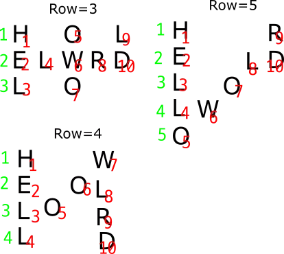
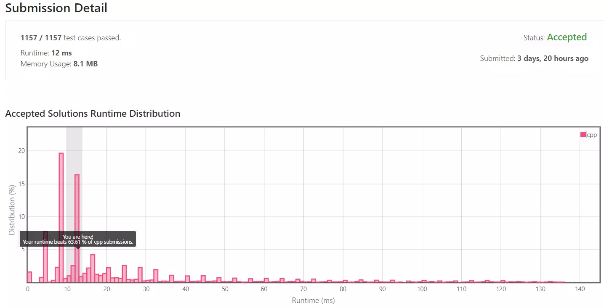

## LeetCode - 6. Zigzag Conversion
문제 - [LeetCode 6. Zigzag Conversion](https://leetcode.com/problems/zigzag-conversion/)

## 문제 설명
지그재그 변환은 문자열을 지그재그로 변환하는 문제입니다.

예를 들어 문자열 `HELLOWORLD`가 있다면

```
H     W
E   W O
L O   R D
L     L
```

와 같이 변환하여 최종적으로 `HWEWOLORDLL`로 변환하는게 목표입니다.

난이도는 `MEDIUM` 난이도 입니다.

## 풀이
### Solution

제가 풀이한 방법은 지그재그의 규칙을 찾아 수식으로 계산하는 방법을 이용하였습니다.



문자열을 Row가 3, 4, 5일때 열 인덱스를 초록색으로 표시하였고, 빨간색 숫자로 일반 문자열의 인덱스를 표현하였다.

첫 번째 열과 마지막 열의 문자열의 인덱스는 row + (numOfRow - 1)*2로 표현할 수 있다

그리고 중간 열에는 무조건 중간에 문자가 하나씩 존재한다. 중간에 위치한 문자의 인덱스는 (row + (numOfRow - 1)\*2) - ((row-1)\*2)로 표현할 수 있다.

#### 제출 결과


12ms의 실행 속도가 나왔으며, 다른 C++ 제출자에 비해 약 60%가량 좋은 성능을 보이게 되었다.

<details>
<summary>코드 전문</summary>
    
```cpp
#include <string>

class Solution 
{
public:
    std::string convert(std::string s, int numRows) 
    {
        if (numRows <= 1) return s;
        
        bool middle = false;
        int curRow = 0;
        int i = 0;
        std::string result = "";

        while (result.size() != s.size())
        {
            int index = curRow + (i * ((numRows - 1) * 2));

            if (curRow % (numRows - 1) != 0)
            {
                if (middle)
                {
                    index -= (curRow * 2);
                    i--;
                    middle = false;
                }
                else
                {
                    middle = true;
                }
            }

            if (index >= s.size())
            {
                curRow++;
                middle = false;
                i = 0;

                continue;
            }

            result += s[index];

            i++;
        }

        return result;
    }
};
```

</details>
