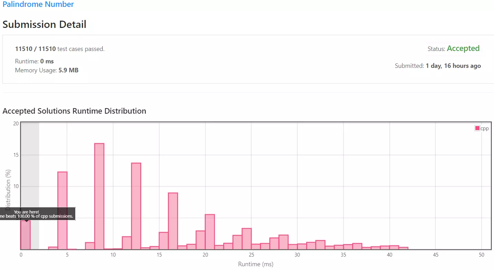

## LeetCode - 9. Palindrome Number
문제 - [LeetCode 9. Palindrome Number](https://leetcode.com/problems/palindrome-number/)

## 문제 설명
정수형 입력값이 회문인지 검사합니다. 만약 121이 입력된다면 121을 뒤집은 값도 121이니 회문입니다.

만약 -121이 들어온다면 뒤집었을 때 121-가 되므로 회문이 아닙니다. 123 또한 뒤집었을 때 321이 되므로 회문이 아닙니다.

난이도는 `EASY` 난이도 입니다.

## 풀이
### Solution

```cpp
bool isPalindrome(int x) 
{
    if (x < 0) return false;
    else if (x < 10) return true;
    else if ((x % 10) == 0) return false;

    long reverse = 0;
    long tmpX = x;

    while (tmpX)
    {
        reverse = (reverse * 10) + (tmpX % 10);
        tmpX /= 10;
    }

    return reverse == x;
}
```

먼저 음수인 경우 절대 회문이 될 수 없기 때문에 `false`를 반환합니다.

숫자가 한 자리인 경우는 무조건 회문이기 때문에 `true`를 반환합니다.

10의 배수는 10, 20, ... 120, 130 등 회문이 절대 될 수 없기 때문에 `false`를 반환합니다.

입력값 x를 뒤집은 값 reverse를 구합니다. reverse의 타입이 `long`인 이유는 x값이 `int`자료형의 최대값이 들어오는 경우 뒤집을 때 연산 중 에러가 발생하기 때문에 `int`보다 큰 자료형인 `long` 자료형을 사용합니다.(별도의 자료형 제한을 두지 않았기 때문에 사용하였습니다.)

#### 제출 결과


0ms의 실행 결과가 표현되었으며, 다른 C++ 제출자보다 100%의 성능을 보였음을 확인할 수 있습니다.

<details>
<summary>코드 전문</summary>
    
```cpp
class Solution 
{
public:
    bool isPalindrome(int x) 
    {
        if (x < 0) return false;
        else if (x < 10) return true;
        else if ((x % 10) == 0) return false;

        long reverse = 0;
        long tmpX = x;

        while (tmpX)
        {
            reverse = (reverse * 10) + (tmpX % 10);
            tmpX /= 10;
        }

        return reverse == x;
    }
};
```

</details>
