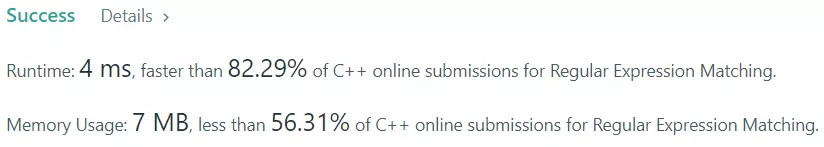

## 목차

## 문제 개요

난이도 - `HARD` 사용 언어 - `C++`


정규 표현식은 주어진 문자열에 대해서 패턴 문자열(정규 표현식)이 주어지면 해당 패턴을 갖는 문자열을 표현하는 방법입니다.

이번 문제에서는 Any character를 나타내는 `"."` 과 0 또는 하나 이상의 문자 집합을 나타내는 `"*"` 패턴 문자를 구현하는 문제입니다.

문제 - [LeetCode 10. Regular Expression Matching](https://leetcode.com/problems/regular-expression-matching/)

## 풀이
### Solution - Dynamic programming
이 문제를 풀기 위해 동적 프로그래밍 방법을 사용했습니다.

패턴을 찾기 위해서 문자열과 패턴 문자열을 모두 순회하면서 패턴을 찾아야 합니다.

여기서 한 가지 특성은, 패턴 "a*"가 주어졌을 때 부분 패턴 문자열 "a"가 문자열에 매칭되면 참이 되며, 이후 추가적인 "a"를 찾을 수도 있고 찾지 못하더라도 참이 될 수 있기 때문에 여러 분기가 발생한다는 것입니다.

동적 프로그래밍 방법을 이용하면 부분 패턴 문자열을 순회하면서 참인 경우를 따로 저장해두고, 나중에 동일한 부분 패턴을 조회할 때 같은 검사를 다시 수행하지 않고 저장된 값을 반환해 성능을 향상시킬 수 있습니다.

```cpp showLineNumbers
std::vector<std::vector<char>> dp;

bool isMatch(int i, int j, const std::string& s ,const std::string& p)
{
    if (dp[i][j] != -1) return dp[i][j];

    ...

    return match;
}
```

먼저 2차원 배열을 선언합니다. 이 배열에 이전에 계산한 결과를 저장합니다. boolean이 아닌 char 타입으로 선언한 이유는, 아직 i, j번째를 순회하지 않은 경우를 따로 나타내기 위해 모든 값을 -1로 초기화했기 때문입니다.

`isMatch` 함수는 i, j, 문자열, 패턴 문자열이 주어지는 함수입니다. i는 s의 부분 문자열의 시작 인덱스, j는 부분 패턴 문자열의 시작 인덱스를 나타냅니다.

```cpp showLineNumbers
bool firstMatch = (i < s.length()) && (p[j] == s[i] || p[j] == '.');

// if Kleene star, character matches zero or more
if (j + 1 < p.length() && p[j + 1] == '*')
{
            // If zero match, skip Kleene star
    match = isMatch(i, j + 2, s, p) || 
            // If non-zero matches, keep finding more matches character
            (firstMatch && isMatch(i + 1, j, s, p));
}
else
{
    // Finding next matches character
    match = firstMatch && isMatch(i + 1, j + 1, s, p);
}
```

매칭을 수행하는 부분만 따로 빼서 자세히 확인해보겠습니다. 먼저 현재 패턴 문자와 입력 문자가 같은지 확인합니다. 만약 패턴 문자가 `'.'`라면 모든 문자와 매칭되므로 `true`가 됩니다.

0개 또는 1개 이상의 문자 집합을 매칭하는 `'*'` 문자는 "a*"처럼 다른 문자와 함께 붙어서 나오기 때문에, 이 부분을 확인하고 별도로 처리합니다.

`'*'` 문자는 0개 또는 1개 이상의 문자와 매칭되기 때문에, 먼저 0개가 매칭된 경우 `isMatch(i, j + 2, s, p)`를 확인합니다. `j+2`는 패턴 문자열의 시작 인덱스를 2만큼 증가시켜 `'*'` 문자 이후의 패턴을 검사한다는 의미입니다.

두 번째로, 문자가 하나 매치된 경우(firstMatch)에는 현재 문자 이후의 문자가 계속 연속적으로 매칭되는지 확인합니다. `(firstMatch && isMatch(i+1, j, s, p))`

만약 `'*'` 문자가 아니라 일반 문자 매칭이라면 i + 1, j + 1에 대해 계속 매치를 시도합니다.

#### 제출 결과


<details>
<summary>코드 전문</summary>
    
```cpp showLineNumbers
#include <string>
#include <vector>

class Solution 
{
public:
    bool isMatch(std::string s, std::string p) 
    {
        std::vector<std::vector<char>> tmp(s.size() + 1, std::vector<char>(p.size() + 1, -1));
        dp.swap(tmp);

        return isMatch(0, 0, s, p);
    }

private:
    std::vector<std::vector<char>> dp;

    bool isMatch(int i, int j, const std::string& s ,const std::string& p)
    {
        if (dp[i][j] != -1) return dp[i][j];

        char match = -1;

        // If no more patterns
        if (j == p.length())
        {
            // True when no more string, If string does not empty, False
            match = (i == s.length());
        }
        else 
        {
            bool firstMatch = (i < s.length()) && (p[j] == s[i] || p[j] == '.');

            // if Kleene star, character matches zero or more
            if (j + 1 < p.length() && p[j + 1] == '*')
            {
                        // If zero match, skip Kleene star
                match = isMatch(i, j + 2, s, p) || 
                        // If non-zero matches, keep finding more matches character
                        (firstMatch && isMatch(i + 1, j, s, p));
            }
            // 
            else
            {
                // Finding next matches character
                match = firstMatch && isMatch(i + 1, j + 1, s, p);
            }
        }

        dp[i][j] = match;

        return match;
    }
};
```

</details>
