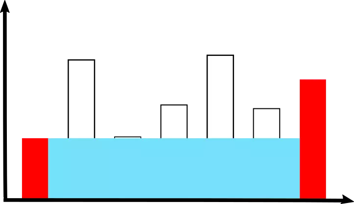
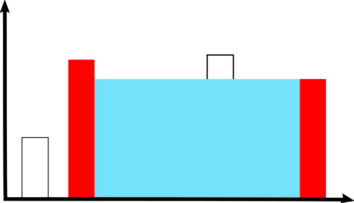
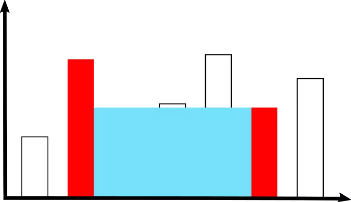

## LeetCode - 11. Container With Most Water
문제 - [LeetCode 11. Container With Most Water](https://leetcode.com/problems/container-with-most-water/)

## 문제 설명


배열에 순서대로 각 막대의 길이가 주어 질 때, 해당 막대 사이에 액체를 담을 때 가장 많이 담긴 양을 구하는 문제입니다.

난이도는 `MEDIUM` 난이도 입니다.

## 풀이
### Solution 1 - Brute force

첫 번째 방법은 먼저 간단히 Brute force, 무차별 대입을 통한 문제 풀이를 시도해보도록 하겠습니다.

중첩된 반복문을 사용해 두 막대를 선택해 가장 큰 크기를 선택합니다.

```cpp
int maxArea = 0;

for (int i = 0; i < count - 1; i++)
{
    for (int j = i; j < count; j++)
    {
        int barHeight = std::min(height[i], height[j]);
        int barWidth = j - i;

        int area = barWidth * barHeight;

        if (area > maxArea)
        {
            maxArea = area;
        }
    }
}
```

넓이를 구하기 위해서는 너비(width)와 높이(height)가 필요합니다. 

두 막대의 높이가 같다면 둘 중 하나의 높이를 사용할 수 있지만, 만약 높이가 다를때 액체를 담는다고 상상하면 낮은쪽의 높이로 액체가 넘치게 되겠죠. 그러므로 둘 중 높이가 낮은쪽을 선택합니다.

너비도 간단히 구할 수 있습니다. 두 막대 사이의 거리를 계산합니다.ㄹ

#### 제출 결과


중첩된 반복문을 사용하고 있기에 시간 복잡도는 O(n^2)의 성능을 보이게 됩니다. 아주 많은 입력이 주어졌을 때 시간 초과가 발생함을 확인할 수 있었습니다.

<details>
<summary>코드 전문</summary>
    
```cpp
#include <vector>
#include <algorithm>

class Solution 
{
public:
    int maxArea(std::vector<int>& height) 
    {
        if (height.size() == 2)
        {
            return  std::min(height[0], height[1]);
        }

        int count = height.size();

        int maxArea = 0;

        for (int i = 0; i < count - 1; i++)
        {
            for (int j = i; j < count; j++)
            {
                int barHeight = std::min(height[i], height[j]);
                int barWidth = j - i;

                int area = barWidth * barHeight;

                if (area > maxArea)
                {
                    maxArea = area;
                }
            }
        }
        
        return maxArea;
    }
};
```

</details>

### Solution 2

두 번째 방법은 첫 번째 방법에서 약간 개선하여 굳이 의미 없는 계산을 빼보도록 하겠습니다.

높이가 가장 큰 두 개의 막대를 선택한다 하더라도 너비가 너무 좁으면 다른 것보다 넓이가 작을 수도 있습니다.

때문에 맨 처음에는 가장 너비가 큰 상태인 첫 번째 막대와 마지막 막대를 선택합니다.



여기서 넓이가 더 커질 수 있는 방법은 왼쪽의 막대가 더 높아진다면 넓이가 더 커질 것입니다. 즉, 오른쪽의 막대는 충분히 길지만, 왼쪽의 막대가 작기때문에 왼쪽 막대로는 기대치 이상의 넓이를 구할 수 없을 것 같습니다.

왼쪽 막대를 한 칸 오른쪽의 막대를 선택합니다.



너비가 1 줄어들었지만, 높이가 너비 이상으로 증가했기 때문에 이전의 결과보다 더 증가하였습니다. 

현재 상황으로는 오른쪽의 막대가 왼쪽 막대보다 높이가 낮기 때문에, 오른쪽의 막대가 더 길어진다면 넓이가 더 증가할 수 도 있을 것 같습니다. 오른쪽의 막대를 한 칸 왼쪽의 막대를 선택합니다.



아쉽지만 오히려 넓이가 낮아졌습니다. 이유는 오른쪽의 막대가 왼쪽의 막대보다 높이가 낮기 때문입니다. 다시 한 번 왼쪽으로 이동합니다.


이런방식으로 계속 순회하며 가장 넓이가 컸었던 값을 선택하면 됩니다.

```cpp
int maxArea = 0;

int left = 0;
int right = height.size() -1;

while (left < right)
{
    int area = std::min(height[left], height[right]) * (right - left);

    maxArea = std::max(area, maxArea);

    if (height[left] < height[right]) left++;
    else right--; 
}

return maxArea;
```

이런 방식으로 순회를 하면 모든 경우를 검사하는 것이 아니기 때문에 최선의 값을 못 찾아 낼 수 있지 않을까? 라는 생각이 들었습니다.

하지만 조금만 생각하니 모든 경우를 검사하지 않더라도 최선의 경우가 나오는지 알 수 있었습니다.

```cpp
if (height[left] < height[right]) left++;
else right--; 
```

한 쪽의 막대가 다른쪽의 막대보다 작으면 인덱스를 1 올리거나, 1을 내려 다음 막대를 선택합니다.

위 코드를 계속해서 실행하게되면 계속해서 두 막대가 경쟁하면서 가장 긴 막대를 선택하려고 시도하게 됩니다. 물론 높이가 가장 높은 두 막대를 선택하더라도 너비가 좁아 더 넓은 공간이 계산되지 않을 수 있습니다.

하지만, 결국 높은 막대를 선택하면 큰 넓이가 나올 수 있는 기대치가 있기 때문에 기대치가 있는 경우에 대해서만 검사하므로 이런 결과가 나오게 되게 됩니다.

#### 제출 결과


시간 복잡도는 O(n)이며 실제 실행 시간은 76ms가 나오며 다른 C++ 제출자보다 91% 가량 좋은 성능을 보임을 알 수 있습니다.

<details>
<summary>코드 전문</summary>
    
```cpp
#include <vector>
#include <algorithm>

class Solution 
{
public:
    int maxArea(std::vector<int>& height) 
    {
        if (height.size() == 2)
        {
            return  std::min(height[0], height[1]);
        }

        int maxArea = 0;

        int left = 0;
        int right = height.size() -1;

        while (left < right)
        {
            int area = std::min(height[left], height[right]) * (right - left);

            maxArea = std::max(area, maxArea);

            if (height[left] < height[right]) left++;
            else right--; 
        }
        
        return maxArea;
    }
};
```

</details>
