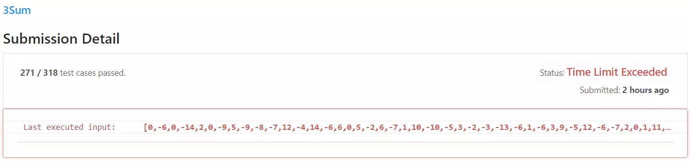
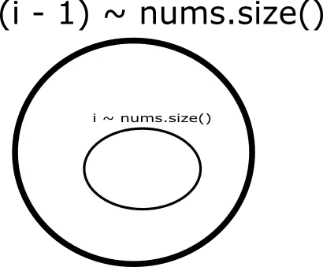
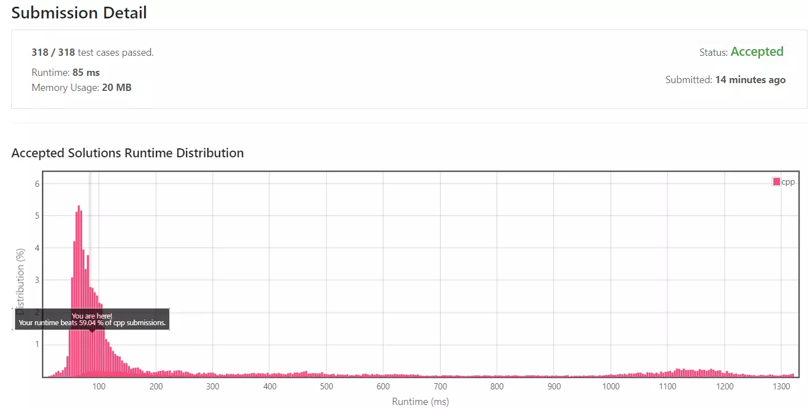

## 목차

## 문제 개요

난이도 - `HARD` 사용 언어 - `C++`

[LeetCode - 2. Add Two Numbers]()과 유사한 문제입니다.

숫자 배열이 주어지면 세 숫자의 합이 0이 되는 모든 가짓수를 찾아내는 문제입니다.

```
Input : [-1, 0, 1, 2, -1, 4]
Output : [[-1, -1, 2], [-1, 0, 1]]
```

또한 중복은 허용되지 않습니다.

문제 - [LeetCode 15. 3Sum](https://leetcode.com/problems/3sum/)

## 풀이
[My Solutions(Github)](https://github.com/LDobac/leetcode/tree/master/15.%203Sum)

### Solution 1 - Brute force
늘 그렇듯 첫 번째 시도는 Brute force를 통해 단순히 코드를 짜는 것부터 시작해보겠습니다.

총 세 개의 숫자를 찾아야 하니 3중 중첩 loop을 이용해 풀어낼 수 있습니다.

```cpp showLineNumbers
for (int i = 0; i < nums.size(); i++)
{
    num1 = nums[i];

    for (int j = 0; j < nums.size(); j++)
    {
        if (j == i) continue;
        else if (num1 > 0 && nums[j] > 0) continue;
        else if (num1 < 0 && nums[j] < 0) continue; 

        num2 = num1 + nums[j];

        for (int k = 0; k < nums.size(); k++)
        {
            if (j == k || i == k) continue;
            else if (num2 > 0 && nums[k] > 0) continue;
            else if (num2 < 0 && nums[k] < 0) continue; 

            num3 = num2 + nums[k];

            if (num3 == 0)
            {
                ...
            }
        }
    }
}
```

루프를 돌면서 첫 번째로 중복 검사를 위해 i, j, k가 동일한 인덱스인지 확인합니다. 만약 동일한 인덱스라면 중복된 것이므로 continue를 수행합니다.

두 번째로, 약간의 최적화를 위해 현재 숫자가 0에 가까워지는 숫자를 선택하도록 합니다.

그리고 선택된 세 숫자의 합이 0이라면 해당 숫자를 결과 배열에 삽입할 수 있습니다.

하지만, 중복을 허용하지 않기 때문에 `[-1, -1, 2]`와 `[-1, 2, -1]`에서 `-1`의 인덱스가 모두 다르더라도 `-1`이 중복이기 때문에 현재 결과에서 중복을 확인할 필요가 있습니다.

```cpp showLineNumbers
auto v = vector<int>{nums[i], nums[j], nums[k]};
sort(v.begin(), v.end()); 

bool push = true;

for (size_t w = 0; w < result.size(); w++)
{
    if (result[w] == v)
    {
        push = false;
        break;
    }
}

if (push)
{
    result.push_back(v);
}
```

결과를 정렬하여 이미 결과에 있는지 확인합니다. 만약 중복이라면 결과 배열에 삽입하지 않습니다.

#### 제출 결과


예상대로 시간 초과가 발생했습니다. 세 숫자를 찾는 3중 반복문에서 $$O(n^3)$$의 시간 복잡도가 발생하고, 마지막에 결과에서 중복을 제거할 때도 반복문을 사용하기 때문에 사실상 $$O(n^4)$$의 시간 복잡도가 됩니다.

정렬까지 하기 때문에 사실상 $$O(n^5)$$의 시간 복잡도라고 봐도 될 듯합니다.

<details>
<summary>코드 전문</summary>

```cpp showLineNumbers
class Solution 
{
public:
    vector<vector<int>> threeSum(vector<int>& nums) 
    {
        vector<vector<int>> result;

        int num1, num2, num3;

        for (int i = 0; i < nums.size(); i++)
        {
            num1 = nums[i];

            for (int j = 0; j < nums.size(); j++)
            {
                if (j == i) continue;
                else if (num1 > 0 && nums[j] > 0) continue;
                else if (num1 < 0 && nums[j] < 0) continue; 

                num2 = num1 + nums[j];

                for (int k = 0; k < nums.size(); k++)
                {
                    if (j == k || i == k) continue;
                    else if (num2 > 0 && nums[k] > 0) continue;
                    else if (num2 < 0 && nums[k] < 0) continue; 

                    num3 = num2 + nums[k];

                    if (num3 == 0)
                    {
                        auto v = vector<int>{nums[i], nums[j], nums[k]};
                        sort(v.begin(), v.end()); 

                        bool push = true;

                        for (size_t w = 0; w < result.size(); w++)
                        {
                            if (result[w] == v)
                            {
                                push = false;
                                break;
                            }
                        }

                        if (push)
                        {
                            result.push_back(v);
                        }
                    }
                }
            }
        }

        return result;
    }
};
```

</details>

---

### Solution 2
생각을 바꿔서 입력되는 숫자를 정렬합니다.

만약 `[-1, 0, 1, 2, -1, 4]`라는 숫자가 주어진다면 `[-1, -1, 0, 1, 2, 4]`로 정렬할 수 있습니다.

여기서 첫 번째 숫자인 `-1`과 마지막 숫자인 `4`를 더하면 `3`을 계산할 수 있습니다.

`3`은 0보다 크므로, 마지막 숫자인 `4` 대신 한 칸 앞에 위치한 `2`를 선택합니다. 그럼 `-1 + 2 = 1`로 첫 번째 계산보다 0에 더 가까워졌음을 확인할 수 있습니다.

이를 통해 왼쪽 인덱스(left)와 오른쪽 인덱스(right)를 두어 적절히 인덱스를 변경하면서 0에 점점 가깝게 계산할 수 있습니다.

이번 문제는 숫자 3개를 선택하는 문제이므로, 간단히 숫자 하나를 고정하고 left와 right를 움직여서 0을 만들 수 있습니다. 그리고 고정하는 숫자를 배열의 처음부터 끝까지 순회하면, 세 숫자를 더했을 때 0이 되는 모든 경우를 구할 수 있습니다.

```cpp showLineNumbers
sort(nums.begin(), nums.end());
```

먼저 입력으로 들어온 숫자 배열을 정렬합니다.

```cpp showLineNumbers
for (int i = 0; i < nums.size(); i++)
{
    if (i > 0 && nums[i] == nums[i - 1]) continue;

    ...
}
```

그리고 숫자 배열을 순회합니다. nums[i]는 해당 순회에서 고정될 숫자입니다.

`if (i > 0 && nums[i] == nums[i - 1]) continue;`

위 구문은 중복된 결과를 제외하기 위한 조건문입니다. 현재 고정할 숫자(nums[i])가 nums[i - 1]와 같다면 현재 반복문은 건너뜁니다.



nums[i] == nums[i - 1]이라면, nums[i - 1]번째 순회에서 찾은 모든 결과를 위 이미지처럼 집합으로 표현했을 때 nums[i]로 찾을 결과가 그 부분 집합이 되어 중복된 결과가 발생할 수 있습니다.

그래서 nums[i] == nums[i - 1]인 경우는 건너뜁니다.

```cpp showLineNumbers
int left = i + 1;
int right = nums.size() - 1;

while (left < right)
{
    int sum = nums[i] + nums[left] + nums[right];

    if (sum > 0) right--;
    else if (sum < 0) left++;
    else
    {
        result.push_back(vector<int>{nums[i], nums[left], nums[right]});

        left++;
        while (nums[left] == nums[left - 1] && left < right) left++;
    }
}
```

합계가 0인 숫자를 찾는 반복문은 매우 간단합니다. left ~ right까지 순회하면서 합이 0보다 크다면 right를 줄이고, 0보다 작다면 left를 증가시킵니다. 그리고 0인 숫자를 찾았다면 결과 배열에 삽입합니다.

이 방식은 입력된 숫자 배열을 정렬했기 때문에 가능합니다.

```while (nums[left] == nums[left - 1] && left < right) left++;```

위 반복문을 넣은 이유도 앞서 설명한 nums[i] == nums[i - 1]일 때 발생하는 중복과 동일합니다. 중복을 제거하기 위해 nums[left]가 nums[left - 1]과 다른 값이 나올 때까지 left를 증가시킵니다.

이해가 잘 되지 않는다면 `[0, 0, 0, 0]`을 입력값으로 테스트해보시면 충분히 이해할 수 있을 것 같습니다.

#### 제출 결과


모든 숫자를 순회하므로 첫 반복문은 $$O(n)$$입니다.

그리고 내부의 while(left < right) 반복문은 $$O(logn)$$이 됩니다. 그래서 전체 시간 복잡도는 $$O(nlogn)$$이 될 것 같습니다.

<details>
<summary>코드 전문</summary>

```cpp showLineNumbers
class Solution 
{
public:
    vector<vector<int>> threeSum(vector<int>& nums) 
    {
        vector<vector<int>> result;

        sort(nums.begin(), nums.end());

        for (int i = 0; i < nums.size(); i++)
        {
            if (i > 0 && nums[i] == nums[i - 1]) continue;

            int left = i + 1;
            int right = nums.size() - 1;

            while (left < right)
            {
                int sum = nums[i] + nums[left] + nums[right];

                if (sum > 0) right--;
                else if (sum < 0) left++;
                else
                {
                    result.push_back(vector<int>{nums[i], nums[left], nums[right]});

                    left++;
                    while (nums[left] == nums[left - 1] && left < right) left++;
                }
            }
        }

        return result;
    }
};
```

</details>
