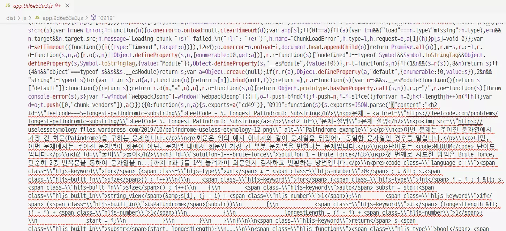
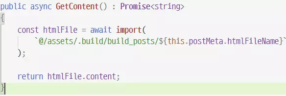
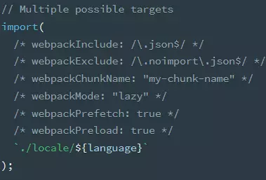
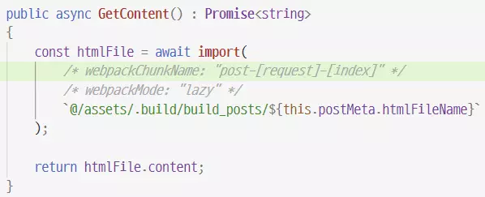

## Webpack의 간단한 소개
Webpack은 흔히 *bundler*라고 부릅니다. 일반적으로 웹 개발을 할 때 다양한 자바스크립트 파일과 css 파일을 생성하게 됩니다.

이러한 파일들을 하나로 묶어 하나의 파일로 생성하는 것을 *bundle* 작업이라하고 이러한 작업을 하는 툴, 라이브러리를 *bundler*라고 부를 수 있을 것 같습니다.

물론 Webpack은 단순히 *bundle* 작업뿐만 아니라 *pipeline*을 통해 일련의 원하는 작업을 수행할 수 있도록 합니다.

Webpack을 통해 여러 파일들이 하나의 파일로 출력된다면 장점은 파일이 간결화되고 중간에 여러 파이프라인을 거쳐 코드들에 대해서 전처리/후처리가 가능하다는 점입니다.

하지만, 단점은 파일을 하나로 합치기 때문에 코드의 용량이 크다면 첫 로딩이 많이 느려지고, 사용자가 당장에 접속하지 않는 페이지의 자원도 처음에 로딩하기때문에 비효율적인 면이 있을수도 있죠.

## 현재 문제점
제가 이 블로그를 개발하면서 게시글은 Markdown으로 작성하고 이를 빌드하여 게시글, 태그 정보(메타데이터)와 같은 내용과 게시글 내용을 별도의 json 파일과 js 파일로 빌드합니다.

이러한 메타데이터와 게시글 파일은 코드 내에서 동적으로 불러오고 있습니다.

json, js 모듈을 동적으로 불러오기 위해 `require`을 이용해 다른 파일의 모듈을 불러오고 있습니다.

위 방식을 이용해 블로그를 빌드하게 된다면

단 5개의 파일만 출력되고 있습니다. chunk_vendors와 post_view js 파일은 제가 임의로 이미 코드를 split 해놓았기 때문에 문제가 없지만, 메타데이터와 게시글의 내용은 모두 app.js 파일 내에 들어가있습니다.

빌드된 app.js 파일의 내용입니다. 알아보기는 힘들지만, 게시글의 모든 내용이 한 파일내에 담겨있습니다. 이 뜻은 유저가 제 블로그에 접속하면 원하지 않더라도 다른 모든 게시글의 내용을 강제로 로드하게 됩니다.

현재 문제가 있는 상태에서 크롬의 개발자 도구 중 네트워크 profiler를 이용해 파일이 로드되는 과정을 확인해보았습니다.

총 4개의 js 파일이 로드되고 있는데, chunk-vendors와 post_view 파일은 제가 임의로 코드를 분리를 해놓았기에 따로 로드되고 있고, 세 번째 파일은 GA이므로, 결국 하나의 app.js가 로드되고 있는데 이 안에 모든 게시글의 내용이 삽입되어 있습니다.

위 페이지는 하나의 게시글을 참조하고 있으나, 다른 모든 게시글의 내용또한 같이 로드되고 있는 상황입니다. 당장에는 용량이 800kb정도 밖에 되지 않지만, 계속해서 게시글이 증가하면 상당히 부담스러워 질 것 같습니다.

webpack의 code split 기능을 이용해 각 게시글과 메타데이터를 별도의 파일로 분리하고, lazy loading을 이용해 게시글을 참조할때만 해당 파일을 새로 로드하도록 개선해보도록 하겠습니다.

### 정적 import에 대한 code split
저희가 이번에 다루는 주제는 동적 import에 대한 code split과 lazy loading을 다루고자 합니다.

정적 import와 동적 import의 이론적인 과정과 내용은 다르나 정적 import 모듈에 대한 code split은 webpack의 config 파일에서 수행하기 때문에 설정하는 방법이 다릅니다.

자세한 사항은 webpack의 code split 페이지를 참고하시면 좋습니다.
[Webpack Code split](https://webpack.js.org/guides/code-splitting/)

## 동적 import, code split 그리고 lazy loading
사실 코드를 각 파일별로 분리하고 lazy loading하는 방법은 이미 webpack에서 **아주 간단히** 제공하고 있는 기능입니다.

[Webpack Dynamic Import](https://webpack.js.org/api/module-methods/#dynamic-expressions-in-import)

단순히 import 함수를 호출해주기만 하면 *code split*과 *lazy loading*을 **둘 다** 기본적으로 수행합니다.

기존 코드는 *require*문을 이용해 모듈을 동적으로 불러오고 있으나, 단순히 *import*문으로 교체해준다면 해결될 것으로 보입니다.

즉, 기존의 아래 코드를 

import 함수로 교체한다면 아래처럼 될 것 같습니다.

아 그리고 require 함수를 동기적으로 동작하지만, import 함수는 비동기적으로 동작하기 때문에 Promise에 대한 처리를 해주어야 합니다. 

동일하게 메타데이터를 불러오는 코드 또한 require함수에서 import 함수로 변경해주었습니다.

자 다시 빌드해보도록 하겠습니다.

단순히 5개였던 파일이 chunk-...js 라는 파일들로 여러개가 생겻습니다. 동시에 app.js 파일의 용량도 이전에 비해 줄어들었네요. 즉, 각 게시글 내용과 메타데이터가 별도의 파일로 분리 된 것입니다.

또한 webpack의 해당 문서에 따르면 import 함수로 동적 로드한 모듈의 경우 lazy loading이 기본적으로 적용된다고 하니 원하는 목적을 모두 달성하였습니다.

### 동적 import에 옵션 전달하기
원하는 목적을 모두 이루었으나, 한 가지 불만인점은 파일명이 chunk-[hash] 값이라서 어떤 게시글 파일인지 식별이 힘든점이 있습니다.

정적 import시 code split과 동일하게 적절한 파일명을 지정할 수도 있고, 옵션을 전달할 수 있습니다.

특이하게 주석을 통해서 해당 동적 import에 대한 옵션을 전달할 수 있습니다.

자세한 설명은 [webpack dynamic import](https://webpack.js.org/api/module-methods/#dynamic-expressions-in-import)문서에서 각 옵션에 대한 설명을 확인할 수 있습니다.

위와 같이 주석을 추가하여 파일명을 적절하게 수정합니다. *[request]*는 파일명으로 치환되고 *[index]*는 단순하게 정수 index 값으로 치환됩니다.

코드를 위와 같이 변경하고 다시 빌드를 수행합니다.

각 분리된 파일들이 식별하기 좋은 이름으로 변경됨을 확인할 수 있습니다.

### require vs import
본 문제를 해결하기 위해서 단순히 *require*문을 *import*문으로 변경하였습니다. Webpack에서는 require문을 통한 동적 모듈 로드시 import처럼 기본적으로 code split과 lazy loading을 지원하지 않는데, 이는 두 모듈 로드 방식에 차이가 있기 때문입니다.

[Reference](https://stackoverflow.com/questions/46677752/the-difference-between-requirex-and-import-x)

일반적으로 require 모듈 로드 방식은 CommonJS, import 로드 방식은 ES6의 로드 방식입니다.

자바스크립트의 표준에 따라서 모듈 로드 방식이 달리지게 됩니다. (babel을 이용한 import문은 require로 변환되지만, 내부적으로 es6의 import와 똑같은 행동을 수행할 수 있도록 변경된다고 합니다.)

require 구문은 미리 출력할 모듈을 계산하지만, import 구문은 호출될 때 구문을 분석하여 출력할 모듈을 결정할 수 있습니다.

이러한 방식 덕분에 require 구문은 동적 모듈 로딩시 자유롭게 할 수 있지만, 실제로 실행하지 않아도 모든 모듈을 불러오게 됩니다.

반대로 import 구문은 require 구문처럼 어떤 경로든 자유롭게 넣을수가 없습니다. 최소한 특정 폴더나, 파일을 지정해주어야 합니다.(webpack 문서에 기술되어 있습니다.) 하지만 구문이 분석되고 나면 필요한 모듈만 따로 로드해서 사용할 수 있는 장점이 있습니다.

Webpack에서는 require 구문또한 lazy loading을 할 수 있는 기능을 제공합니다. 

[Webpack-specific require](https://webpack.js.org/api/module-methods/#webpack)

다만 webpack을 사용하지 않는 경우라면 위 기능은 사용할 수 없으니 주의해야 합니다.

### network profiler로 확인

동적 import에 대해서 code split과 lazy loading을 하였으니, 블로그를 탐험할 때 본적도 없고 아직 보지도 않은 모든 게시글의 글 내용을 모두 불러오는 불상사는 없어졌을 것으로 생각됩니다.

다시 한 번 크롬의 개발자 도구내 network profiler로 확인을 해보겠습니다.

블로그 메인에 접속시 기존과 다르게 게시글 메타데이터에 대한 정보 파일이 분리되어 별도로 로딩됨을 확인할 수 있습니다. 또한 app.js의 파일 크기도 기존에는 800kb 크기에서 600kb쯔음의 크기로 줄어들었습니다.

이제 게시글 하나에 접속해보겠습니다.

새로운 파일이 하나 로드되었고, 해당 파일이 post-...로 시작하니 게시글 내용을 담은 파일임을 확인할 수 있습니다. 즉, 블로그에 접속하면 모든 게시글 내용을 다 불러오는게 아니라, 게시글을 조회할때만 해당 게시글의 내용을 lazy loading함을 확인할 수 있습니다.

## Conclusion
모든 게시글이 하나의 파일로 합쳐져서 게시글을 조회하지 않더라도 모든 게시글의 내용이 함께 로드되는 문제를 수정했습니다.

모든 자바스크립트 코드를 하나의 파일로 합치면 첫 로딩은 느리지만, 이후의 반응성이 좋아진다는 장점이 있습니다.

하지만, 아직 유저가 읽지도 않고, 읽을지도 모르는 모든 게시글을 로드하는 것은 자원 낭비가 되겠죠.

이렇듯 lazy loading을 사용하여 code bundle에 대한 장점은 살리고, 필요할때만 자원을 로드해 반응성을 살릴 수 있었습니다.