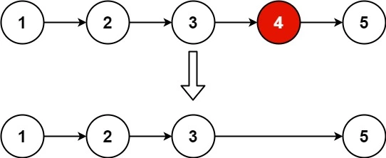

## 목차

## 문제 개요

난이도 - `MEDIUM` 사용 언어 - `C++`



단방향 연결 리스트와 삭제할 인덱스가 입력으로 주어집니다.

삭제할 인덱스는 연결 리스트의 끝에서 n번째의 노드를 삭제합니다.

위 사진의 예시는 [1, 2, 3, 4, 5]의 연결 리스트가 주어지고, n = 2가 주어졌기 때문에 리스트의 끝에서 2번째인 `[4]` 노드가 삭제됩니다.

문제 - [LeetCode - 19. Remove Nth Node From End of List](https://leetcode.com/problems/remove-nth-node-from-end-of-list/)

## 풀이
[My Solutions(Github)](https://github.com/LDobac/leetcode/tree/master/19.%20Remove%20Nth%20Node%20From%20End%20of%20List)

### Solution
양방향 연결 리스트가 아니라 단방향이기 때문에 next 포인터밖에 없습니다.

그래서 리스트의 끝에서 n번째 노드를 삭제하기 위해서는 리스트를 두 번 순회해야 합니다.

첫 번째 순회는 연결 리스트의 길이를 알아내는 과정입니다. 길이를 알아야 리스트의 끝에서 n번째 노드를 찾을 수 있습니다.

```cpp showLineNumbers
ListNode* cur = head;
int length = 0;
while (cur)
{
    length++;

    cur = cur->next;
}
```

그리고 두 번째 순회는 삭제할 노드를 찾기 위한 것입니다. 연결 리스트의 길이는 이미 알아냈으니, 뒤에서 n번째 노드를 찾으려면 length - n번 순회하면 됩니다.

```cpp showLineNumbers
ListNode* prevOfTarget = nullptr;
ListNode* target = head;
for (int i = length - n; i > 0; i--)
{
    prevOfTarget = target;
    target = target->next;
}
```

단방향 연결 리스트이므로 삭제할 노드와 그 이전 노드를 따로 변수에 저장합니다.

```cpp showLineNumbers
if (prevOfTarget == nullptr)
{
    head = target->next;
}
else
{
    prevOfTarget->next = target->next;
}
```

만약 이전 노드가 `nullptr`이라면 head 노드를 삭제하는 것이 되므로, head가 삭제할 노드의 다음 노드를 가리키게 합니다.

아니라면 일반 연결 리스트 삭제 과정을 수행합니다.


#### 제출 결과


실행 속도는 4ms가 나왔습니다. 실행할 때마다 조금씩 달라지는 leetcode의 실행 속도 특성 때문에 4ms가 나온 듯합니다. 몇 번 더 재시도하면 0ms의 실행 속도가 나올 수도 있을 것 같습니다.

<details>
<summary>코드 전문</summary>

```cpp showLineNumbers
class Solution 
{
public:
    ListNode* removeNthFromEnd(ListNode* head, int n) 
    {
        if (!head->next && n > 0)
        {
            return nullptr;
        }

        ListNode* cur = head;
        int length = 0;
        while (cur)
        {
            length++;

            cur = cur->next;
        }
        
        ListNode* prevOfTarget = nullptr;
        ListNode* target = head;
        for (int i = length - n; i > 0; i--)
        {
            prevOfTarget = target;
            target = target->next;
        }

        if (prevOfTarget == nullptr)
        {
            head = target->next;
        }
        else
        {
            prevOfTarget->next = target->next;
        }
        
        return head;
    }
};
```

</details>
