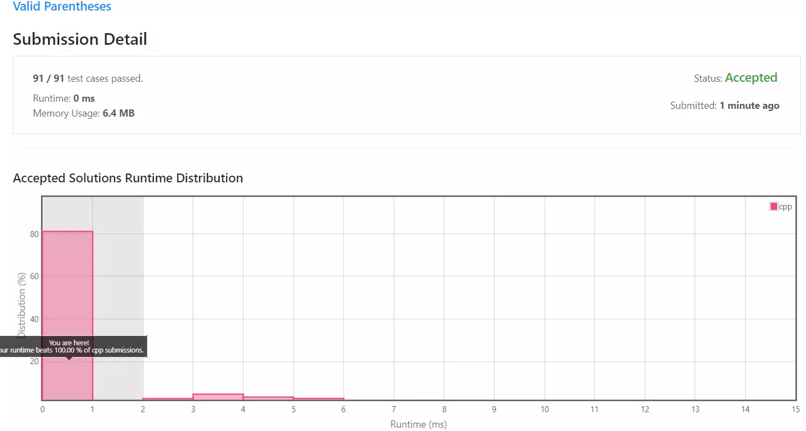

## 목차

## 문제 개요

난이도 - `EASY` 사용 언어 - `C++`

문자열이 주어질 때 소괄호`()`, 중괄호`{}`, 대괄호`[]`가 올바른 순서로 잘 열리고 닫혔는지 확인하는 문제입니다.

문제 - [LeetCode - 20. Valid Parentheses](https://leetcode.com/problems/valid-parentheses/)

## 풀이
[My Solutions(Github)](https://github.com/LDobac/leetcode/tree/master/20.%20Valid%20Parentheses)

### Solution - Stack
괄호는 늘 짝을 지어 닫혀야 합니다. 또한 소괄호 안에 또 소괄호가 열리거나, 다른 괄호 안에 또 다른 괄호가 열리는 등 괄호가 중첩되기 때문에, 새로운 괄호가 열리면 그 짝이 되는 닫힘 괄호가 등장해야 합니다.

그래서 문자열을 순회하면서 가장 최근에 열린 괄호의 짝을 찾아야 하며, 그 짝을 찾고 나면 이전에 순회했던 열린 괄호의 짝을 찾아야 합니다.

즉 FILO(First In Last Out)로 맨 처음에 순회되었던 괄호가 가장 나중에 닫혀야 합니다. 그러므로 이번 문제 풀이를 위해 스택 자료구조를 사용합니다.

```cpp showLineNumbers
stack<char> openBrackets;
```

C++ STL의 stack 자료구조를 선언합니다.

```cpp showLineNumbers
for (char ch : s)
{
    ...
}
```

그리고 입력된 문자열을 순회합니다. 반복문 내에서 괄호가 올바르게 열리고 닫혔는지 확인합니다.

```cpp showLineNumbers
if ('(' == ch || '{' == ch || '[' == ch)
{
    openBrackets.push(ch);
}
```

처음으로는 열린 괄호를 확인합니다. 열린 괄호라면 스택에 삽입해 가장 최근에 삽입된(스택의 top) 열린 괄호의 짝인 닫힌 괄호를 찾습니다.

```cpp showLineNumbers
else if (')' == ch || '}' == ch || ']' == ch)
{
    if (openBrackets.size() == 0) return false;

    char openBracket = openBrackets.top();

    if (
        !(
            ('(' == openBracket && ')' == ch) || 
            ('{' == openBracket && '}' == ch) || 
            ('[' == openBracket && ']' == ch)
        )
    )
    {
        return false;
    }

    openBrackets.pop();
}
```

만약 닫힌 괄호라면 스택의 top을 가져와 가장 최근에 탐색된 열린 괄호와 짝인지 확인합니다. 짝이 아니라면 함수는 false를 반환하고, 짝이라면 스택에서 해당 열린 괄호를 pop한 후 계속 순회합니다.

닫힌 괄호가 등장했는데 열린 괄호를 저장하는 스택의 크기가 0이라면, 잘못 닫힌 괄호이므로 즉시 false를 반환합니다.

```cpp showLineNumbers
return openBrackets.size() == 0;
```

모든 순회가 끝나면 결과를 반환합니다. 단, 스택의 크기가 0이 아니라면 정상적으로 닫히지 않은 괄호가 있다는 뜻이므로 false를 반환하도록 합니다.

추가로 자잘한 최적화를 위해 함수의 시작 부분에 다음 구문을 추가했습니다.

```cpp showLineNumbers
if (s.size() % 2 != 0) return false;
```

정상적으로 열리고 닫힌 괄호는 2개의 문자로 이루어졌으므로, 만약 입력된 문자열의 길이가 홀수라면 하나의 문자는 정상적으로 닫히거나 열리지 않았다는 의미가 됩니다.

그러므로 입력된 문자열의 길이가 홀수라면 즉시 false를 반환합니다.

#### 제출 결과


<details>
<summary>코드 전문</summary>

```cpp showLineNumbers
class Solution 
{
public:
    bool isValid(string s) 
    {
        if (s.size() % 2 != 0) return false;

        stack<char> openBrackets;

        for (char ch : s)
        {
            if ('(' == ch || '{' == ch || '[' == ch)
            {
                openBrackets.push(ch);
            }
            else if (')' == ch || '}' == ch || ']' == ch)
            {
                if (openBrackets.size() == 0) return false;

                char openBracket = openBrackets.top();

                if (
                    !(
                        ('(' == openBracket && ')' == ch) || 
                        ('{' == openBracket && '}' == ch) || 
                        ('[' == openBracket && ']' == ch)
                    )
                )
                {
                    return false;
                }

                openBrackets.pop();
            }
        }

        return openBrackets.size() == 0;
    }
};
```

</details>
